> **Freshness (2026-06-13 audit):** written 2026-05-29; 411 commits have landed since. Structure remains broadly accurate; counts and inventories are stale. Verified figures: [docs/audit/2026-06-13](audit/2026-06-13/README.md).

# AgentFarm — Full System Architecture

> Built from direct source code inspection of every service, package, and schema file.  
> No guessing. No documentation reuse. Every fact below is sourced from the actual code.  
> Last compiled: Sprint 18 (2026-05-29) — Content Writer gap closure, pgvector memory, desktop VM, disclosure compliance.

---

## Table of Contents

1. [Platform Overview](#1-platform-overview)
2. [System Map — All Services](#2-system-map--all-services)
3. [High-Level Architecture Diagram](#3-high-level-architecture-diagram)
4. [Data Model](#4-data-model)
5. [API Gateway (Control Plane)](#5-api-gateway-control-plane)
6. [Agent Runtime (Execution Plane)](#6-agent-runtime-execution-plane)
7. [Agent Task Execution Flow](#7-agent-task-execution-flow)
8. [Developer Agent — Deep Dive](#8-developer-agent--deep-dive)
9. [Role Enforcement Framework](#9-role-enforcement-framework)
10. [Model Routing](#10-model-routing)
11. [Approval Flow](#11-approval-flow)
12. [Memory Architecture](#12-memory-architecture)
13. [Connector / OAuth System](#13-connector--oauth-system)
14. [MCP Protocol Integration](#14-mcp-protocol-integration)
15. [VM Provisioning Lifecycle](#15-vm-provisioning-lifecycle)
16. [Desktop Agent — Vision Loop](#16-desktop-agent--vision-loop)
17. [Trigger Service — Event Ingestion](#17-trigger-service--event-ingestion)
18. [Orchestrator — Multi-Agent Coordination](#18-orchestrator--multi-agent-coordination)
19. [Billing Flow](#19-billing-flow)
20. [Agent Persona & Disclosure Layer](#20-agent-persona--disclosure-layer)
21. [Role Implementations](#21-role-implementations)
22. [Dashboard (Operator UI)](#22-dashboard-operator-ui)
23. [Website / Marketplace](#23-website--marketplace)
24. [Observability Stack](#24-observability-stack)
25. [Security Controls](#25-security-controls)
26. [Queue Contracts & Message Flows](#26-queue-contracts--message-flows)
27. [Known Gaps & Open Decisions](#27-known-gaps--open-decisions)

---

## 1. Platform Overview

AgentFarm is a **multi-tenant AI staffing platform**. Companies hire AI workers (agents) by role. Every agent runs in an isolated Docker container on an Azure VM, interacts with real tools via MCP connectors or full-desktop vision loops, and operates under human-in-the-loop approval controls.

**12 supported roles** (from `RoleKey` in `packages/shared-types`):

| Key | Role Name |
|---|---|
| `developer` | Developer Agent |
| `fullstack_developer` | Full Stack Developer |
| `tester` | Tester Agent |
| `sales_rep` | Sales Representative |
| `corporate_assistant` | Corporate Assistant |
| `business_analyst` | Business Analyst |
| `technical_writer` | Technical Writer |
| `content_writer` | Content Writer |
| `marketing_specialist` | Marketing Specialist |
| `project_manager_product_owner_scrum_master` | PM / PO / Scrum Master |
| `recruiter` | Recruiter |
| `customer_support_executive` | Customer Support Executive |

**Technology stack:**
- TypeScript / Node 20 ESM — all apps and packages
- Next.js 14 — dashboard, website
- Fastify — api-gateway, agent-runtime, orchestrator, trigger-service
- Python 3 / Flask — desktop-agent vision loop
- PostgreSQL + Prisma + pgvector — all persistent state
- Azure ARM REST API — VM provisioning
- Anthropic (Claude Haiku/Opus) + OpenAI (GPT-4o) — LLM
- Stripe + Razorpay — payments
- Application Insights + OpenTelemetry — observability

---

## 2. System Map — All Services

### Applications (`apps/`)

| Service | Port | Tech | Purpose |
|---|---|---|---|
| `apps/api-gateway` | 3000 | Fastify | Central control plane — all HTTP traffic from clients and agents |
| `apps/agent-runtime` | dynamic | Fastify | Per-workspace agent execution server |
| `apps/orchestrator` | — | Fastify | Multi-agent coordination, GOAP planning, routine scheduling |
| `apps/trigger-service` | 3002 | Fastify | External event ingestion — webhook, email, Slack |
| `apps/dashboard` | — | Next.js 14 | Operator dashboard (approval queue, monitoring, controls) |
| `apps/website` | — | Next.js 14 | Customer marketplace, hire wizard, checkout |

### Services (`services/`)

| Service | Tech | Purpose |
|---|---|---|
| `services/provisioning-service` | Node/TS | Standalone VM lifecycle manager (second provisioning path) |
| `services/desktop-agent` | Python/Flask | Screenshot → LLM → xdotool vision execution loop, port 5003 |
| `services/browser-agent` | Node/TS | Playwright headless browser automation |
| `services/notification-service` | Node/TS | Slack, Teams, Email, Webhook dispatch |
| `services/audit-storage` | Node/TS | Evidence bundle persistence |
| `services/memory-service` | Node/TS | pgvector episodic + semantic memory |
| `services/meeting-agent` | Node/TS | Meeting join, transcript, summary, distribution |

### Packages (`packages/`)

| Package | Purpose |
|---|---|
| `packages/shared-types` | All TypeScript contracts, status enums, role keys — 40+ CONTRACT_VERSIONS |
| `packages/db-schema` | Prisma schema, migrations for PostgreSQL |
| `packages/queue-contracts` | Queue name constants (7 queues) |
| `packages/connector-contracts` | Connector type registry, tool allowlists per role |
| `packages/observability` | `initObservability()` — Application Insights + OTEL setup |
| `packages/auth-utils` | JWT, session token utilities |
| `packages/config` | Shared env/config constants |
| `packages/sdk` | Public client SDK |
| `packages/redis-client` | Redis connection wrapper |
| `packages/notification-service` | Notification provider implementations |
| `packages/crm-service` | CRM integration utilities |
| `packages/erp-service` | ERP integration utilities |

---

## 3. High-Level Architecture Diagram

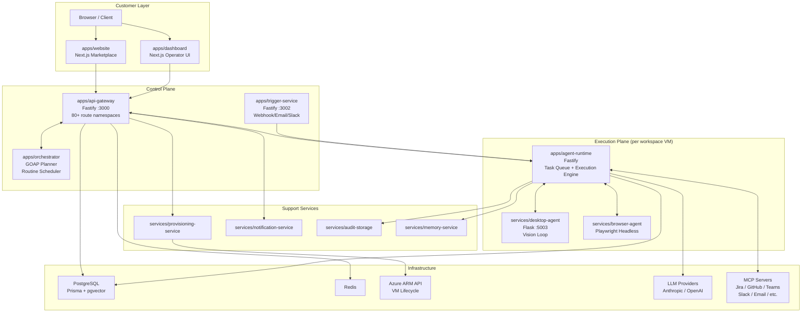

---

## 4. Data Model

Built entirely from `packages/db-schema/prisma/schema.prisma`.

### Core Hierarchy

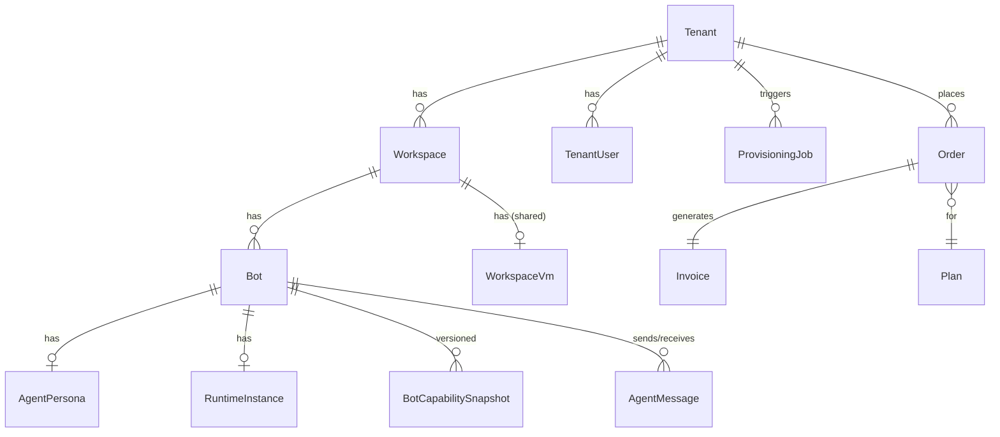

### Key Models

| Model | Purpose |
|---|---|
| `Tenant` | Top-level customer organization (id, name, status, plan) |
| `Workspace` | Logical unit — holds bots sharing a VM (tenantId, name, status) |
| `Bot` | An agent instance (workspaceId, role, status, containerPort) |
| `AgentPersona` | Agent identity: displayName, emailAddress, avatarUrl, communicationStyle, disclosureStatement, language, timezone, workingHours |
| `SetupWizardSession` | Multi-step hire wizard state: currentStep, completedSteps, selectedRole, connectors[], approvalPolicy |
| `ProvisioningJob` | VM/container provisioning tracker — 10-state lifecycle |
| `WorkspaceVm` | One Azure VM per workspace: vmName, vmResourceId, resourceGroup, privateIp, region, vmSize, activeContainerCount, nextContainerPort |
| `RuntimeInstance` | Live runtime registry: endpoint, heartbeatAt, status (created → ready → active → stopped) |
| `BotCapabilitySnapshot` | Frozen role capabilities: allowedConnectorTools[], allowedActions[], brainConfig, languageTier |
| `ActionRecord` | Per-action audit row: actionType, riskLevel, inputSummary, outputSummary, approvalId |
| `Approval` | Human approval record: riskLevel, decision (pending/approved/rejected/timeout_rejected), escalatedAt, decidedAt |
| `AuditEvent` | Immutable audit log: eventType, severity, summary, sourceSystem, correlationId |
| `ConnectorAuthMetadata` | OAuth state: connectorType, authMode, status, grantedScopes, tokenExpiresAt, lastErrorClass |
| `ConnectorAction` | Per-connector-call log: actionType, resultStatus, providerResponseCode, errorCode, remediationHint |
| `TaskExecutionRecord` | Billing metering: modelProvider, promptTokens, completionTokens, latencyMs, estimatedCostUsd |
| `AgentShortTermMemory` | Per-task working memory: actionsTaken, approvalOutcomes, connectorsUsed, summary. TTL ~7 days |
| `AgentLongTermMemory` | pgvector(1536) episodic memory: pattern, confidence, observedCount, embedding |
| `AgentSession` | Browser audit session: recordingId, recordingUrl, actionCount, retentionExpiresAt |
| `BrowserActionEvent` | Per-click/type/scroll row with before/after screenshots, DOM snapshots, networkLog |
| `StoredEvidenceBundle` | Immutable evidence: taskId, screenshots[], signature, finalised |
| `TenantMcpServer` | Per-tenant registered MCP server: name, url, headers, isActive |
| `MeetingSession` | Meeting participation: platform, transcript, summaryText, actionItems |
| `AgentDispatchRecord` | Agent-to-agent handoff log: fromAgentId, toAgentId, taskDescription, orchestrationRunId |
| `Plan` | Subscription plan: priceUsd, agentSlots, features, roleType |
| `Order` | Purchase record: paymentProvider, providerOrderId, contractPdfUrl, signatureStatus |

### Status Enums (from `packages/shared-types`)

**`ProvisioningJobStatus`**:
```
queued → validating → creating_resources → bootstrapping_vm 
       → starting_container → registering_runtime → healthchecking 
       → completed | failed → cleanup_pending → cleaned_up
```

**`RuntimeStatus`**: `created → starting → ready → active → degraded → paused → stopping → stopped → failed`

**`BotStatus`**: `created → bootstrapping → connector_setup_required → active → paused → failed`

---

## 5. API Gateway (Control Plane)

**File**: `apps/api-gateway/src/main.ts`  
**Port**: `API_GATEWAY_PORT ?? 3000`  
**Framework**: Fastify + Helmet (strict CSP: `defaultSrc none`, `frameAncestors none`), 1MB body limit

### Route Namespaces (80+ registered)

```
Auth
  registerAuthRoutes              POST /v1/auth/login, /v1/auth/refresh, /v1/auth/logout
  registerPortalAuthRoutes        Tenant portal auth

Connector
  registerConnectorAuthRoutes     OAuth initiate / callback / revoke
  registerConnectorActionRoutes   POST /v1/connectors/:id/execute (Jira, Teams, GitHub, Email, etc.)
  registerConnectorHealthRoutes   GET  /v1/connectors/:id/health

Approvals
  registerApprovalRoutes          GET/POST /v1/approvals — intake, list, decide, escalate

Memory
  registerMemoryRoutes            GET/POST /v1/memory (short-term workspace memory)
  registerKnowledgeBaseRoutes     GET/POST /v1/kb (semantic RAG)
  registerEpisodicMemoryRoutes    GET/POST /v1/memory/episodic (pgvector)

Agent Lifecycle
  registerAgentLifecycleRoutes    POST /v1/agents/provision, /v1/agents/:id/pause, /resume, /terminate

Billing
  registerBillingRoutes           POST /v1/billing/create-order
                                  POST /v1/billing/stripe/webhook
                                  POST /v1/billing/razorpay/webhook
                                  POST /v1/billing/metering/snapshot

Setup Wizard
  registerSetupWizardRoutes       POST /v1/wizard/start, /v1/wizard/:id/step, /v1/wizard/:id/complete
  ⚠️  Called WITHOUT onWizardComplete — wizard completion does NOT auto-trigger provisioning

Marketplace
  registerMarketplaceRoutes       GET /v1/marketplace/bots, /v1/marketplace/bots/:id

Desktop
  registerDesktopActionRoutes     POST /v1/desktop/actions
  registerDesktopSessionsRoutes   POST/GET /v1/desktop/sessions
  registerDesktopProfileRoutes    GET/POST /v1/desktop/profiles

Personas
  registerPersonaRoutes           GET/POST /v1/personas/:botId
  registerDisclosureRoutes        POST /v1/disclosures/verify

Sales
  registerLeadRoutes              GET/POST /v1/leads
  registerProspectsRoutes         GET/POST /v1/prospects
  registerSalesConfigRoutes       GET/POST /v1/sales/config
  registerOutreachRoutes          POST /v1/outreach/send
  registerDealsRoutes             GET/POST /v1/deals

Orchestration
  registerOrchestrationRoutes     POST /v1/orchestration/run

Meetings
  registerMeetingRoutes           POST /v1/meetings/join, /leave, /speak, /summary
  registerChatRoutes              POST /v1/chat/message

Autonomous
  registerAutonomousLoopRoutes    POST /v1/autonomous/run

Background Workers (started at boot)
  startProvisioningWorker         Polls ProvisioningJob queue, drives 7-state VM machine
  startConnectorTokenLifecycleWorker  Refreshes expiring OAuth tokens
  startConnectorHealthWorker      Periodic connector health checks
  startNurtureWorker              Outreach nurture sequence runner
  startSalesSequenceWorker        Sales sequence step executor
```

### Approval Packet (`apps/api-gateway/src/lib/approval-packet.ts`)

Structured packet parsed from agent-submitted approval requests:

| Field | Description |
|---|---|
| `change_summary` | What the agent proposes to do |
| `impacted_scope` | Files / systems that will change |
| `risk_reason` | Why the action is classified at this risk level |
| `proposed_rollback` | How to undo if approved and then fails |
| `lint_status` | Pre-submission lint result |
| `test_status` | Pre-submission test result |
| `packet_complete` | Whether all required fields are populated |

---

## 6. Agent Runtime (Execution Plane)

**File**: `apps/agent-runtime/src/runtime-server.ts`  
**Framework**: Fastify  
**Health Port**: from `RUNTIME_HEALTH_PORT` env

### Runtime Configuration (`RuntimeConfig`)

```typescript
type RuntimeConfig = {
    tenantId: string;
    workspaceId: string;
    botId: string;
    roleProfile: RoleProfile;    // connector allowlist, action allowlist, approval policy
    roleKey: RoleKey;            // developer | tester | sales_rep | ...
    approvalApiUrl: string;
    connectorApiUrl: string;
    evidenceApiUrl: string;
    memoryApiUrl: string;
    gatewayApiUrl: string;
    modelProvider: string;       // anthropic | openai | agentfarm
    modelProfile: ModelProfileKey; // quality_first | speed_first | cost_balanced | custom
}
```

### Runtime State Machine

```
created → starting → ready → active → degraded → paused → stopping → stopped → failed
```

### Injectable Dependencies (`RuntimeServerOptions`)

30+ injectable functions / clients for full testability:

| Dependency | Purpose |
|---|---|
| `approvalIntakeClient` | Submit approvals to api-gateway |
| `connectorActionExecuteClient` | Execute connector (Jira, GitHub, etc.) actions |
| `memoryStore` | Per-developer episodic memory (PrismaMemoryStore) |
| `visionCaller` | Screenshot analysis (Anthropic / OpenAI) |
| `localWorkspaceActionExecutor` | 200+ local workspace actions dispatcher |
| `prisma` | Direct DB access for memory and evidence |
| `episodicEmbed` | pgvector embedding function (1536-dim) |
| `semanticEmbed` | Semantic knowledge embedding function |
| `llmDecisionResolver` | LLM-based task classification override |
| `roleClassifierFn` | Role enforcement classifier |
| `killSwitchCheckFn` | Active kill-switch enforcer |
| `desktopAgentUrl` | URL of the vision loop service |

### Task Envelope

```typescript
type TaskEnvelope = {
    taskId: string;
    payload: Record<string, unknown>;  // action_type, prompt, target_files, tenantId, botId, ...
    enqueuedAt: string;
    lease?: { expiresAt: string; token: string };
}
```

### Pre-Task Pipeline (in `processOneTask`)

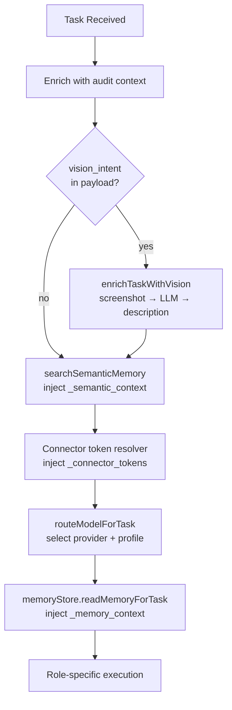

---

## 7. Agent Task Execution Flow

End-to-end from external trigger to result:

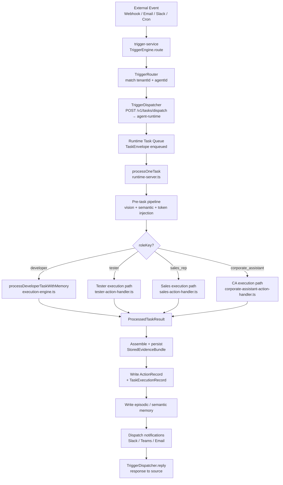

---

## 8. Developer Agent — Deep Dive

**Files**: `apps/agent-runtime/src/execution-engine.ts`, `autonomous-coding-loop.ts`

### `processDeveloperTask()` — Phase-by-Phase

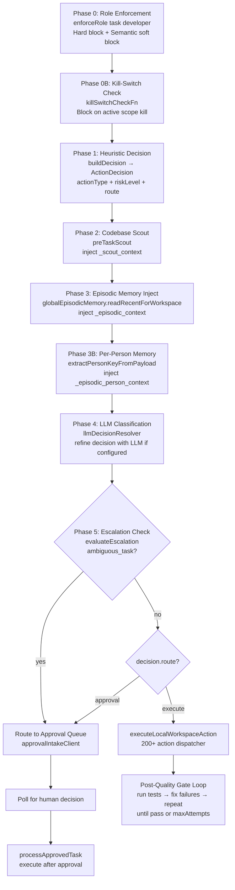

### `ActionDecision` (output of buildDecision / LLM)

```typescript
type ActionDecision = {
    actionType: string;       // what action to execute
    confidence: number;       // 0.0–1.0
    riskLevel: 'low' | 'medium' | 'high';
    route: 'execute' | 'approval';
    reason: string;           // audit trail
}
```

### Autonomous Coding Loop (`autonomous-coding-loop.ts`)

Triggered by `workspace_autonomous_plan_execute` or `workspace_github_issue_fix`:

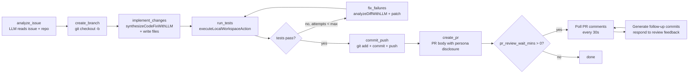

Each step produces a checkpoint in `.agentfarm/` for resume after partial failures.

---

## 9. Role Enforcement Framework

**File**: `apps/agent-runtime/src/role-enforcer.ts`

Two-phase enforcement runs **before** any LLM call to protect quota and security:

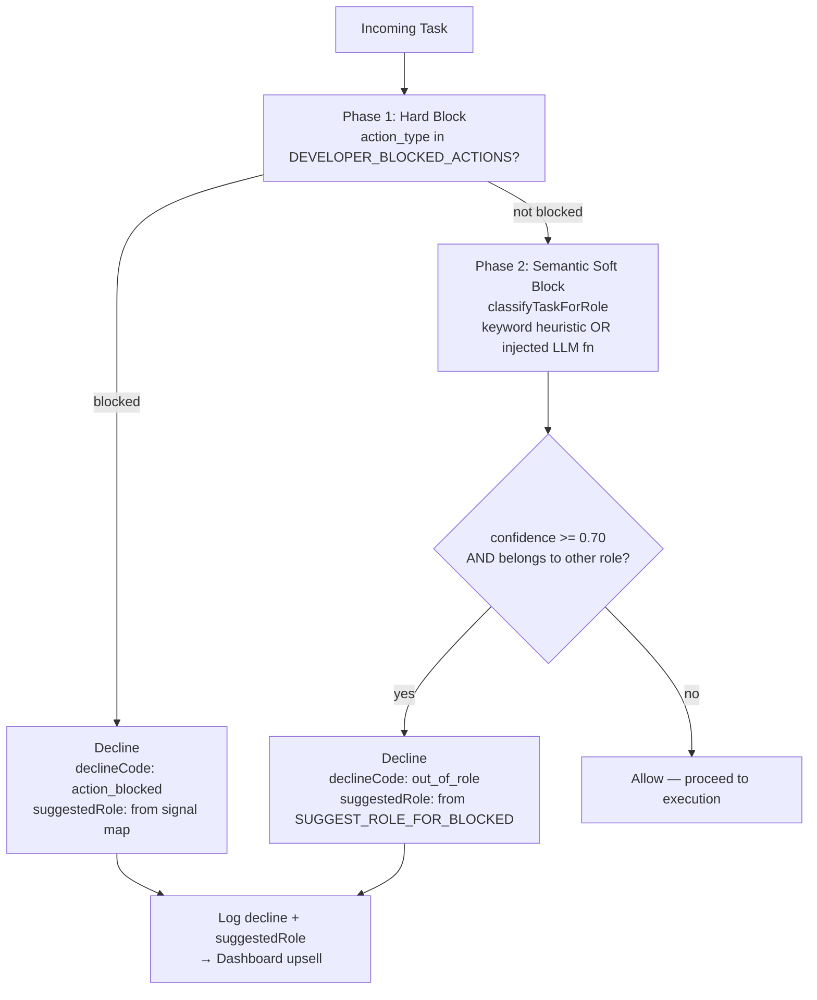

**Three enforcement layers** (from `packages/connector-contracts` + `role-profiles/`):

| Layer | Mechanism | File |
|---|---|---|
| Tool allowlist (hard) | TESTER_ROLE_ALLOWED_CONNECTORS, DEVELOPER_BLOCKED_ACTIONS | `tester-agent-profile.ts`, `developer-role-profile.ts` |
| Task classifier (soft) | `classifyTaskForRole()` — keyword + optional LLM | `task-classifier.ts` |
| Approval policy | Out-of-role borderline actions flagged to human manager | `escalation-evaluator.ts` |

---

## 10. Model Routing

**File**: `apps/agent-runtime/src/model-router.ts`

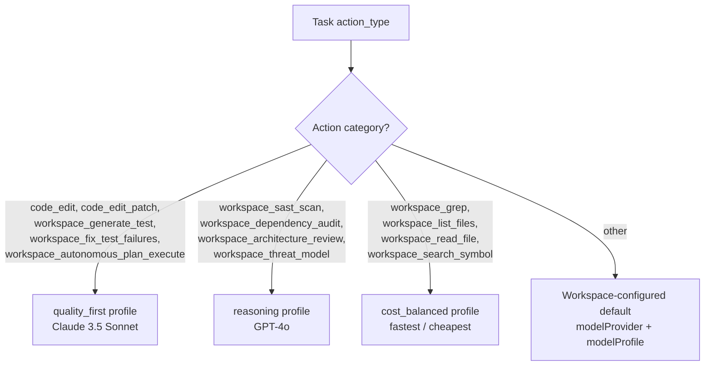

**`ModelRouteDecision`** fields: `provider`, `profile`, `reason`, `overridden`  
**`ModelProfileKey`** values: `quality_first | speed_first | cost_balanced | custom`

---

## 11. Approval Flow

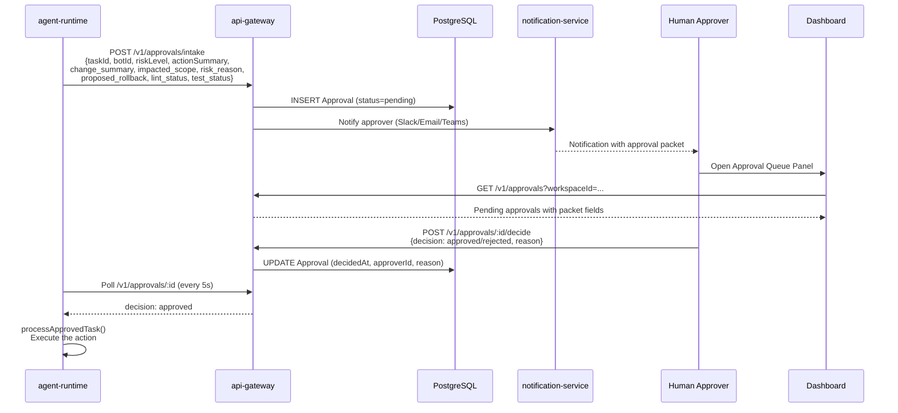

**Escalation**: After `escalationTimeoutSeconds` (default 3600s), approval auto-escalates. Marked via `escalatedAt` field. Secondary notification sent to escalation contacts.

**Risk Scoring**:
- `low` → auto-execute, no approval required
- `medium` → soft approval (timeout → auto-approve)
- `high` → hard approval (timeout → auto-reject)

---

## 12. Memory Architecture

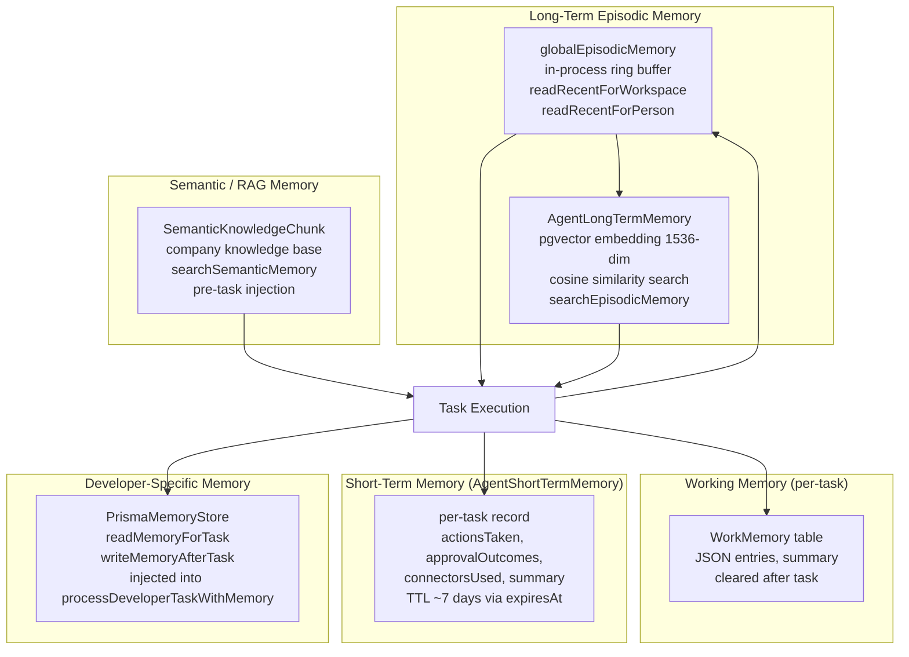

### Memory Read/Write per Role

| Role | Pre-task Read | Post-task Write |
|---|---|---|
| All | `searchSemanticMemory` → `_semantic_context` | — |
| Developer | `globalEpisodicMemory.readRecent()` → `_episodic_context`<br/>`PrismaMemoryStore.readMemoryForTask()` → `_memory_context` | `PrismaMemoryStore.writeMemoryAfterTask()` |
| Tester | `globalEpisodicMemory.readRecent()` | `writeSemanticMemory()` (bug patterns)<br/>`writeEpisodicMemory()` |
| Sales Rep | `globalEpisodicMemory.readRecentForPerson()` → per-person context | `writeEpisodicMemory()` |
| Corporate Assistant | `globalEpisodicMemory.readRecent()` | — |

**pgvector** embedding: `vector(1536)` column in `AgentLongTermMemory`. Migration `20260520000000_add_agent_persona` required. Currently: `writeEpisodicMemoryNoEmbed` used as fallback (stores without vector).

---

## 13. Connector / OAuth System

**Files**: `apps/api-gateway/src/routes/connector-auth.ts`, `connector-actions.ts`

### OAuth Flow

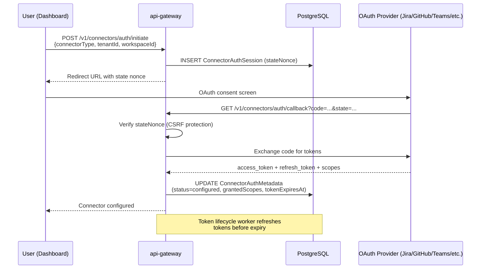

### Connector Action Execution

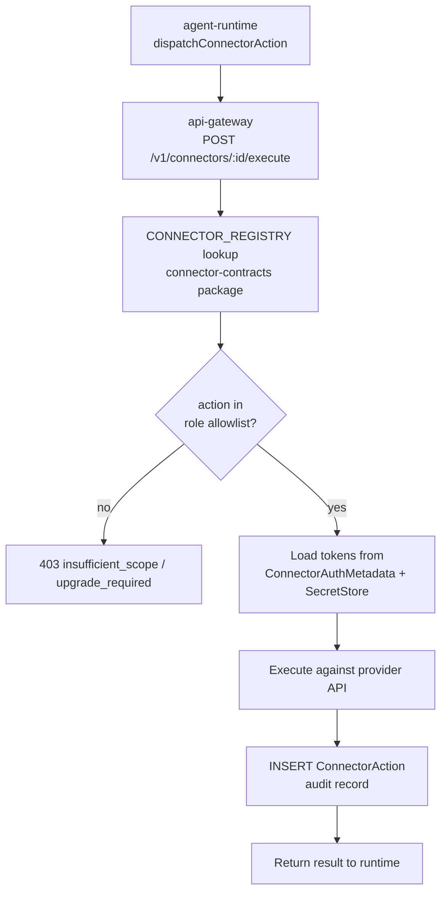

### Connector Types Supported

`jira`, `teams`, `github`, `email`, `custom_api`, `gitlab`, `slack`, `linear`, `jenkins`, `circleci`, `selenium`, `playwright`, `cypress`, `appium`, `jmeter`, `postman`, `soapui`, `testrail`, `zephyr`, `burpsuite`, `owasp_zap`

### Error Classes (`ConnectorErrorClass`)

`oauth_state_mismatch | oauth_code_exchange_failed | token_refresh_failed | token_expired | insufficient_scope | provider_rate_limited | provider_unavailable | secret_store_unavailable`

---

## 14. MCP Protocol Integration

**File**: `apps/agent-runtime/src/mcp-protocol-client.ts`

Protocol: **JSON-RPC 2.0**, MCP spec version `2024-11-05`

### McpProtocolClient

```typescript
class McpProtocolClient {
    async initialize(): Promise<{protocolVersion, serverInfo}>  // MCP handshake — MUST be first
    async listTools(): Promise<McpTool[]>                       // discover available tools
    async callTool(name, args): Promise<McpToolCallResult>      // invoke a tool
}
```

Default timeout: `AGENTFARM_MCP_TIMEOUT_MS` env (default 30s)

### Session Provisioners (per role)

Each role has a MCP provisioner that:
1. Fetches tenant's registered MCP servers from gateway
2. Auto-registers any missing connectors that have env-var URLs
3. Returns `Map<connectorId, McpProtocolClient>` for the session
4. Caches sessions in-process for 10 minutes

| Provisioner File | Role | Key Connectors |
|---|---|---|
| `tester-mcp-provisioner.ts` | Tester | jira, linear, github, gitlab, teams, slack, email, jenkins, circleci, selenium, playwright, cypress, appium, jmeter, postman, soapui, testrail, zephyr, burpsuite, owasp_zap |
| `sales-rep-mcp-provisioner.ts` | Sales Rep | hubspot, salesforce, gmail, calendar, linkedin, apollo |
| `corporate-assistant-mcp-provisioner.ts` | Corporate Assistant | gmail, calendar, teams, slack, sharepoint, confluence |

**`TenantMcpServer` table**: allows tenants to bring their own MCP servers (custom internal tools, proprietary systems). Registered via `/v1/wizard/step` or directly via API.

---

## 15. VM Provisioning Lifecycle

**Two paths exist** (historical — needs consolidation):
1. **Path A**: `apps/api-gateway/src/services/provisioning-worker.ts` — runs as background worker inside api-gateway
2. **Path B**: `services/provisioning-service/` — standalone microservice with its own queue consumer

Both write to the same `ProvisioningJob` table.

### Provisioning State Machine

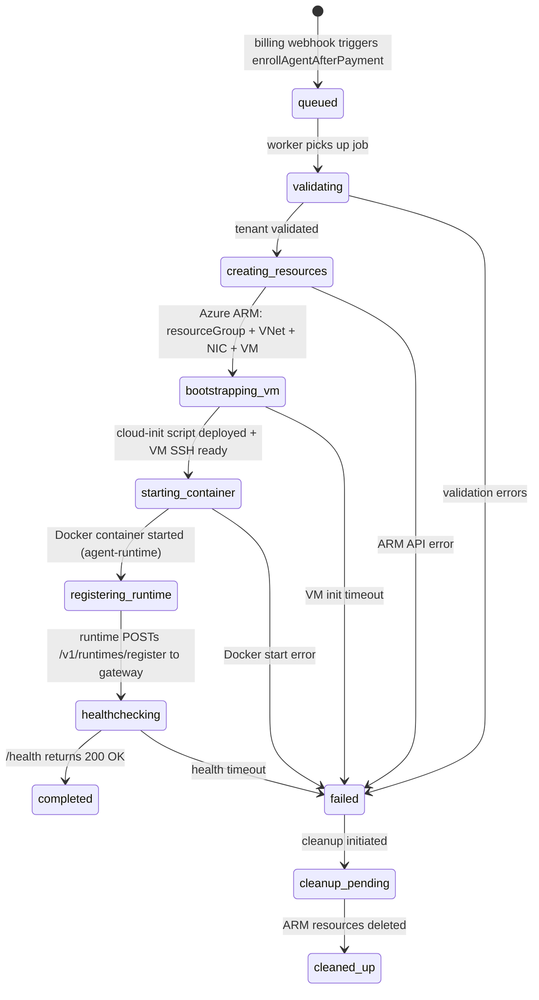

### Azure ARM Components Created (per workspace VM)

From `VmLifecycleManager.DefaultAzureArmAdapter`:
1. Resource Group (`rg-agentfarm-{tenantId}-{region}`)
2. Virtual Network + Subnet
3. Network Interface Card
4. Virtual Machine (`Standard_B4ms` default) with cloud-init
5. VM Extension: run bootstrap script (Docker install + container pull)

### WorkspaceVm model fields

- `vmSize`: `Standard_B4ms` (configurable)
- `activeContainerCount`: incremented per bot added
- `nextContainerPort`: starts at 8081, incremented per container
- One VM shared across all bots in a workspace (cost optimization)

### Auth for ARM API

- Primary: `AZURE_CLIENT_ID` + `AZURE_CLIENT_SECRET` + `AZURE_TENANT_ID` → client credentials token
- Fallback: Managed Identity (`http://169.254.169.254/metadata/identity`) — used when running inside Azure
- No-op stubs auto-activate when `AZURE_SUBSCRIPTION_ID` not set (local dev)

---

## 16. Desktop Agent — Vision Loop

**File**: `services/desktop-agent/app.py`  
**Port**: 5003  
**Framework**: Flask + CORS  
**Environment**: Xvfb virtual display (`DISPLAY=:1`), 1280x800

### Vision Execution Loop

```mermaid
flowchart TD
    START[POST /vision-task<br/>{session_id, goal, max_steps}] 
    --> SS[_screenshot<br/>scrot --silent → base64 PNG]
    SS --> LLM[_llm_decide<br/>screenshot + goal + history → LLM<br/>returns JSON action array 1-3 actions]
    LLM --> ACT{action.type?}
    ACT -- click --> CLK[xdotool mousemove x y<br/>xdotool click 1]
    ACT -- type --> TYP[xdotool type --clearmodifiers text]
    ACT -- key --> KEY[xdotool key keyname]
    ACT -- scroll --> SCR[xdotool mousemove + click 4/5]
    ACT -- open_app --> APP[subprocess.Popen command]
    ACT -- done --> DONE[Return result]
    CLK --> NEXT{step < MAX_VISION_STEPS<br/>AND time < VISION_LOOP_TIMEOUT}
    TYP --> NEXT
    KEY --> NEXT
    SCR --> NEXT
    APP --> NEXT
    NEXT -- yes --> SS
    NEXT -- no --> TIMEOUT[Return timeout result]
```

**Limits**: `MAX_VISION_STEPS = 20`, `VISION_LOOP_TIMEOUT = 300s`

### Form Filling Rules (`_FORM_FILLING_RULES`)

The LLM system prompt includes explicit form-filling discipline:
1. Click first input field
2. `Ctrl+A` to select all
3. `Delete` to clear
4. Type new value
5. `Tab` to advance to next field

### Session Management

```
POST /sessions        → create session (taskId, goal, metadata)
POST /sessions/stop   → terminate session
GET  /sessions/:id    → status, step count, last action
GET  /health          → {"status": "ok", "display": ":1"}
```

Sessions stored in-memory (`_sessions` dict). Process restart clears all sessions.

### Meeting Join (Playwright integration)

For Zoom, Teams, Google Meet: DOM-based Playwright actions run before falling back to vision loop. Meeting join uses direct button selectors before switching to screenshot mode.

---

## 17. Trigger Service — Event Ingestion

**File**: `apps/trigger-service/src/`  
**Port**: `TRIGGER_SERVICE_PORT ?? 3002`

### Architecture

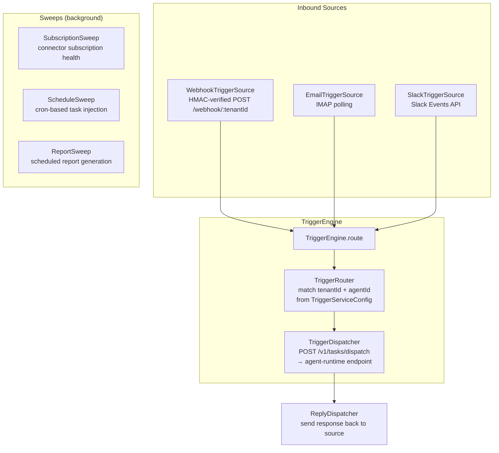

### HMAC Webhook Security

Every inbound webhook validates an HMAC-SHA256 signature in `X-Webhook-Signature` header. Signature computed over raw request body using `WEBHOOK_SHARED_SECRET`. Replay prevention via timestamp window check.

---

## 18. Orchestrator — Multi-Agent Coordination

**File**: `apps/orchestrator/src/`

### Components

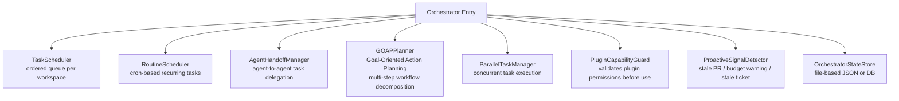

### GOAP Planning

`GOAPPlanner` decomposes a high-level goal into an ordered sequence of agent actions by:
1. Representing current world state and goal state
2. Finding action sequences (using forward search) to bridge the gap
3. Outputting `OrchestrationRun` with ordered `AgentDispatchRecord[]`

### Routine Scheduler

Registered routines (from `routine-scheduler.ts`):

| Routine | Schedule | Payload |
|---|---|---|
| `registerCorporateAssistantDailyStandup()` | `0 9 * * *` (09:00 daily) | `{ action: 'workspace_ca_standup_report' }` |
| Feature flag | `scheduler.ca_standup` | Dedupe key: `ca-standup-${botId}` |

### Agent Handoff (`AgentDispatchRecord`)

```typescript
{
    fromAgentId: string;     // initiating agent
    toAgentId: string;       // receiving agent
    taskDescription: string; // what to do
    orchestrationRunId: string; // parent run
    subTaskIndex: number;    // position in sequence
    status: 'queued' | 'running' | 'completed' | 'failed';
    wakeSource: 'agent_handoff';
}
```

### Proactive Signal Detection

`ProactiveSignalDetector` monitors for:
- PRs with no activity > N hours → suggest merge / close
- Workspace budget > 80% consumed → alert
- Jira tickets unassigned for > X days → suggest assignment
- Meeting transcript action items with no follow-up → nudge

---

## 19. Billing Flow

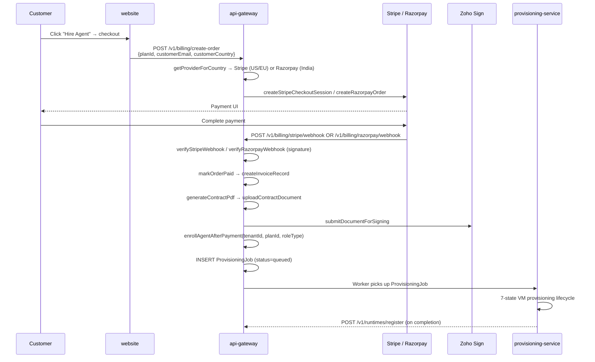

### Usage Metering

- `computeMeteringPeriodSummary()`: aggregates `TaskExecutionRecord` by billing period
- `PER_TASK_PLATFORM_FEE_USD`: fee per task execution (from shared-types)
- `estimatedCostUsd` on `TaskExecutionRecord`: computed from token counts + model rates
- `platformFeeUsd`: AgentFarm markup per task
- Monthly metering snapshot: `POST /v1/billing/metering/snapshot`

---

## 20. Agent Persona & Disclosure Layer

**File**: `apps/agent-runtime/src/agent-persona-loader.ts`, `outbound-disclosure.ts`

### Persona Resolution

```mermaid
flowchart TD
    TASK[processOneTask] --> LOAD[loadPersonaForBot<br/>GET /v1/personas/:botId<br/>via api-gateway]
    LOAD --> CACHE{In-process cache<br/>TTL 60s}
    CACHE -- hit --> INJECT
    CACHE -- miss --> FETCH[Fetch AgentPersona from DB]
    FETCH --> CACHE2[Update cache]
    CACHE2 --> INJECT[Inject _persona into task payload<br/>{displayName, emailAddress,<br/>communicationStyle,<br/>disclosureStatement}]
```

### Disclosure Enforcement (`outbound-disclosure.ts`)

`applyDisclosureToConnectorPayload()` — called before every outbound connector action (email, Slack, Teams):
1. Appends `disclosureStatement` to message body
2. Uses `_persona.displayName` as sender name
3. Injects `Reply-To: _persona.emailAddress` on emails
4. Signs outbound message with `signOutbound()` for tampering detection

**Compliance**: EU AI Act + FTC disclosure requirements — disclosure text is configurable per agent but cannot be empty.

### AgentPersona Schema Fields

| Field | Description |
|---|---|
| `displayName` | Agent's human-facing name (e.g. "Alex — AI Developer") |
| `emailAddress` | Agent's email address (e.g. alex@customer.agentfarm.ai) |
| `avatarUrl` | Profile image for meeting attendance |
| `communicationStyle` | `professional | friendly | technical | formal` |
| `disclosureStatement` | "This message was sent by an AI agent." |
| `language` | Default output language (ISO 639-1) |
| `timezone` | Agent's operating timezone |
| `workingHours` | JSON: `{start: "09:00", end: "17:00", days: [1,2,3,4,5]}` |

---

## 21. Role Implementations

### Developer Agent

- **Execution**: `processDeveloperTaskWithMemory` → `processDeveloperTask`
- **Autonomous loop**: `autonomous-coding-loop.ts` (analyze → branch → implement → test → fix → PR)
- **MCP servers**: No dedicated provisioner — uses generic `TenantMcpServer` list
- **Memory**: `PrismaMemoryStore` + `globalEpisodicMemory` + semantic search
- **200+ local actions** in `local-workspace-executor.ts` covering all code lifecycle tiers

### Tester Agent

- **Handler**: `tester-action-handler.ts`
- **5 primary actions**:
  1. `workspace_standup_report` — generate test status summary, optionally join meeting + speak
  2. `workspace_test_case_sync` — sync test cases to/from Jira/TestRail/Zephyr
  3. `workspace_test_run_publish` — publish test run results to tracker
  4. `workspace_create_bug` — file bug in Jira/Linear with evidence
  5. `workspace_security_test_report` — aggregate SAST/DAST results from `.agentfarm/` cache
- **MCP provisioner**: `tester-mcp-provisioner.ts` — 20 connectors
- **Memory**: writes bug patterns to semantic memory post-task

### Sales Rep Agent

- **Handler**: `sales-action-handler.ts`
- **10 primary actions**:
  1. `workspace_prospect_research` — `findAndSaveProspects()` via `prospect-finder.ts`
  2. `workspace_icp_score` — `scoreProspect()` via `icp-scorer.ts`
  3. `workspace_email_personalize` — `personaliseEmail()` via `email-personaliser.ts`
  4. `workspace_outreach_send` — `sendOutreachEmail()` via `outreach-orchestrator.ts`
  5. `workspace_sequence_create` — `scheduleFollowUps()` via `sequence-scheduler.ts`
  6. `workspace_reply_classify` — `classifyReply()` via `reply-classifier.ts`
  7. `workspace_pre_meeting_research` — `generatePreMeetingBrief()` via `pre-meeting-research.ts`
  8. `workspace_booking_invite` — `sendBookingInvite()` via `booking-invite-sender.ts`
  9. `workspace_contract_send` — `sendContractInvite()` via `contract-sender.ts`
  10. `workspace_deal_close` — `closeDealWon/Lost()` via `deal-closer.ts`
- **MCP provisioner**: `sales-rep-mcp-provisioner.ts`
- **Episodic memory**: per-prospect history via `readRecentForPerson()`

### Corporate Assistant

- **Handler**: `corporate-assistant-action-handler.ts`
- **11 action types** across 5 domain modules:
  - Email: `workspace_ca_email_compose`, `workspace_ca_email_send`, `workspace_ca_email_classify`
  - Calendar: `workspace_ca_calendar_check`, `workspace_ca_calendar_schedule`, `workspace_ca_calendar_cancel`
  - Document: `workspace_ca_document_create`, `workspace_ca_document_update`
  - Escalation: `workspace_ca_escalate`
  - Messaging: `workspace_ca_message_send`
  - Standup: `workspace_ca_standup_report` (daily at 09:00 via RoutineScheduler)
- **MCP provisioner**: `corporate-assistant-mcp-provisioner.ts`

---

## 22. Dashboard (Operator UI)

**File**: `apps/dashboard/app/page.tsx` and `app/components/`

### Panel Map

| Panel | Purpose |
|---|---|
| `ApprovalQueuePanel` | Pending approvals with structured packet: change_summary, impacted_scope, risk_reason, proposed_rollback, lint_status, test_status. Detail drawer for each approval. |
| `AgentMemoryPatternPanel` | Visualize learned patterns from AgentLongTermMemory |
| `AgentQuestionPanel` | Async Q&A — agent asks questions, human answers (AgentQuestion table) |
| `ConnectorConfigPanel` | OAuth connector status (scopeStatus, lastErrorClass, lastHealthcheckAt) |
| `EvidenceCompliancePanel` | Browse StoredEvidenceBundle records |
| `RuntimeObservabilityPanel` | RuntimeStatus timeline, heartbeat latency |
| `LlmConfigPanel` | Model provider/profile configuration |
| `WorkspaceBudgetPanel` | Spend tracking (TaskExecutionRecord aggregation) |
| `SkillMarketplacePanel` | Browse and activate skill packs |
| `GovernanceKPIPanel` | KPIs: approval rate, escalation rate, task success rate |
| `DeveloperAgentOverviewPanel` | Developer-specific: PR count, test pass rate, code quality |
| `DeveloperAgentStatusPanel` | Current autonomous loop step, last action |
| `KillSwitchBanner` | Active kill-switch warning + resume controls |
| `AgentControlPanel` | Pause / Resume / Redirect controls (BotStatus management) |
| `TaskRetryPanel` | Retry failed tasks with optional parameter override |
| `MissionMiniNav` | Active task navigation |
| `CommandPalette` | Keyboard shortcut global command palette |

### Dashboard Data Types

```typescript
type WorkspaceBotSummary = {
    workspace_id, tenant_id, workspace_name, role_type,
    bot_id, bot_name, bot_status, workspace_status,
    runtime_tier, last_heartbeat_at, provisioning_status,
    latest_incident_level
}

type UsageSummary = {
    action_count, approval_count, connector_error_count,
    runtime_restart_count, estimated_cost
}
```

---

## 23. Website / Marketplace

**Files**: `apps/website/app/marketplace/page.tsx`, `components/marketplace/MarketplaceGrid.tsx`, `lib/bots-catalogue.ts`

### Marketplace Structure

- **179 auto-generated bot catalogue entries** in `bots-catalogue.ts`
- **37 hand-crafted native bot icons** in `MarketplaceGrid.tsx`
- **Department filter**: Engineering, Sales, HR, Finance, Marketing, Operations, Customer Support, Legal
- **Cart/hire flow**: select → configure → checkout → provisioning
- **Dedicated landing pages**: `DEDICATED_DETAIL_PAGES` map (e.g. `ai-backend-developer → /marketplace/developer`)

### Key Routes

| Route | Purpose |
|---|---|
| `/marketplace` | Grid of all 179 bots |
| `/marketplace/developer` | Developer Agent dedicated page |
| `/marketplace/tester` | Tester Agent dedicated page |
| `/checkout` | Purchase flow (Stripe / Razorpay) |
| `/book-demo` | Demo booking |
| `/get-started` | Signup / onboarding |

### Setup Wizard Flow (5 steps via `SetupWizardSession`)

```
Step 1: select_role      → choose from 12 agent roles
Step 2: connect_tools    → OAuth connector setup (stored in connectors[])
Step 3: configure_persona → displayName, email, communicationStyle, disclosureStatement
Step 4: set_approvals    → approval policy: auto-approve threshold, escalation contacts
Step 5: deploy           → createBot + createAgentPersona + trigger ProvisioningJob
```

> ⚠️ **Gap**: `registerSetupWizardRoutes` in api-gateway is called without `onWizardComplete` callback. Wizard completion does NOT currently trigger provisioning automatically — only billing webhooks do. Fix: pass `onWizardComplete` that inserts a `ProvisioningJob`.

---

## 24. Observability Stack

**Package**: `packages/observability/src/index.ts`  
**Called at startup of**: api-gateway, agent-runtime, orchestrator

### `initObservability()`

Initializes:
1. **Azure Application Insights** — `APPLICATIONINSIGHTS_CONNECTION_STRING` env
2. **OpenTelemetry SDK** — traces, metrics, logs
3. **Custom metrics**: task execution count, approval rate, connector error rate, token usage

### Audit Logging (`writeAuditEvent`)

Every significant action writes to `AuditEvent` table:
- `eventType`: from `AuditEventType` enum
- `severity`: `info | warn | error | critical`
- `correlationId`: threads through all related records (ActionRecord, ConnectorAction, Approval, AuditEvent)

### Browser Action Audit (`BrowserActionEvent`)

Every browser action (click, type, navigate) logged with:
- Before + after screenshots (by ID reference)
- DOM snapshot hash (tamper detection)
- Network log (JSON)
- `correctnessAssertion` (LLM-verified result)

### Retention Policies (`RetentionPolicy`)

Configurable per tenant/workspace/role:
- `RetentionPolicyScope`: `tenant | workspace | role`
- `RetentionPolicyAction`: `never_delete | delete_after | anonymize_after`
- `retentionDays`: days before action triggers
- Retention cleanup service processes expired records on schedule

---

## 25. Security Controls

| Control | Implementation |
|---|---|
| **Authentication** | JWT sessions via `packages/auth-utils`. `getSession()` injected into all route handlers. 401 on missing session. |
| **Authorization (RBAC)** | `ROLE_RANK` map in `require-role.ts`. Enforced in billing routes (`admin` required for create-order). |
| **Connector OAuth CSRF** | `stateNonce` in `ConnectorAuthSession`. Verified on callback before token exchange. |
| **Webhook HMAC** | `WebhookTriggerSource` validates `X-Webhook-Signature` HMAC-SHA256 over body using `WEBHOOK_SHARED_SECRET`. |
| **Content Security Policy** | Helmet: `defaultSrc: none`, `frameAncestors: none` — no inline scripts, no framing. |
| **Body size limit** | 1MB cap on all Fastify instances. |
| **Outbound message signing** | `signOutbound()` in `outbound-signer.ts` — tamper-detection signature on all agent-generated messages. |
| **Role enforcement** | Two-phase hard+soft block before any LLM call. Role boundary violations logged to AuditEvent. |
| **Kill switch** | `KillSwitchCheckFn` injectable — halts task execution for active kill-switch scopes. |
| **Secret storage** | `SecretStore` abstraction (Key Vault or env). Connector tokens never stored in plaintext DB. |
| **Provisioning auth** | Azure Managed Identity or client credentials — never hardcoded keys. |
| **Input validation** | `validate()` utility in api-gateway used at all route boundaries. |
| **Disclosure enforcement** | Outbound messages cannot omit AI disclosure. `disclosureStatement` cannot be empty in AgentPersona. |

---

## 26. Queue Contracts & Message Flows

**File**: `packages/queue-contracts/src/index.ts`

### 7 Named Queues

| Queue Constant | Purpose |
|---|---|
| `QUEUE_PROVISIONING` | VM/container provisioning jobs |
| `QUEUE_APPROVAL` | Approval requests from runtime → api-gateway |
| `QUEUE_EVIDENCE` | Evidence bundles for storage |
| `QUEUE_RUNTIME_TASKS` | Task envelopes to agent-runtime |
| `QUEUE_ROUTINE_TASKS` | Scheduled/recurring tasks from orchestrator |
| `QUEUE_MEETING` | Meeting join/leave/speak commands |
| `QUEUE_NOTIFICATION` | Notification dispatch (Slack/Teams/Email/Webhook) |

### Message Flow Overview

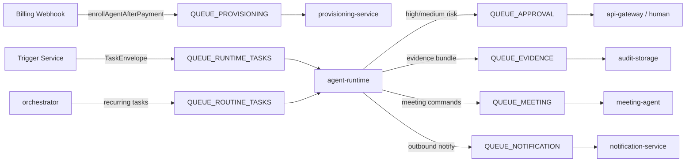

---

## 27. Known Gaps & Open Decisions

The following gaps were discovered during direct code inspection:

### Critical Gaps

| # | Gap | Location | Impact |
|---|---|---|---|
| 1 | **Wizard → Provisioning not wired** | `apps/api-gateway/src/main.ts` ~line 751: `registerSetupWizardRoutes(app, {})` called WITHOUT `onWizardComplete` | Completing the setup wizard does NOT create a ProvisioningJob — only billing webhook does |
| 2 | **Dual provisioning paths** | `apps/api-gateway/src/services/provisioning-worker.ts` AND `services/provisioning-service/` both write to `ProvisioningJob` table | Risk of double-processing the same job |
| 3 | **pgvector embeddings dormant** | `writeEpisodicMemoryNoEmbed()` used as fallback when `episodicEmbed` not wired | Vector similarity search returns empty — episodic memory stored but not searchable |
| 4 | **Semantic memory not wired for Developer** | `searchSemanticMemory()` is injected in runtime-server but the knowledge base needs initial population | Developer agent gets empty `_semantic_context` until knowledge base is populated |

### Feature Gaps (deferred by design)

| # | Gap | Notes |
|---|---|---|
| 5 | **pgvector migration not applied** | `20260520000000_add_agent_persona` Prisma migration must be run against live DB | `vector(1536)` column on `AgentLongTermMemory` not available until migration runs |
| 6 | **PR review comment loop** | `pr_review_wait_mins` parameter exists in `AutonomousLoopInput` but polling logic requires PR API connectivity | Must set up GitHub/GitLab connector before usable |
| 7 | **noVNC / full desktop VM** | `services/desktop-agent/app.py` is built but noVNC streaming to dashboard not wired | Vision loop works; browser stream to customer not available |
| 8 | **Role profiles for 10 roles** | Only Developer, Tester, Sales Rep, Corporate Assistant have handlers | Remaining 8 roles have `RoleKey` constants but no action handlers |
| 9 | **Marketplace to billing end-to-end not tested** | Website checkout → webhook → provisioning chain needs E2E test | Smoke test only; no automated E2E coverage |
| 10 | **Pre-task disambiguation prompt** | `evaluateEscalation` runs ambiguity check but no structured pre-task Q&A loop for senior-tier agents | Agent may start coding on ambiguous spec without asking |

### Open Architectural Decisions

| Decision | Options |
|---|---|
| **One subscription or multiple** for UAT/Prod Azure environments | Single sub with RBAC isolation vs separate subscriptions |
| **Container strategy** | Azure Container Apps (serverless scale) vs App Service (predictable) |
| **Provisioning path consolidation** | Keep api-gateway worker (simpler) vs promote standalone service (scalable) |
| **pgvector host** | Self-managed Postgres vs Azure Database for PostgreSQL Flexible with pgvector extension |

---

## Appendix A — Local Workspace Action Tiers

All 200+ actions in `apps/agent-runtime/src/local-workspace-executor.ts`, organized by tier:

| Tier | Actions |
|---|---|
| 1–4 Core Dev | `code_read`, `code_edit`, `code_edit_patch`, `git_clone`, `git_branch`, `git_commit`, `git_push`, `git_merge`, `run_tests`, `run_build` |
| 5 External Knowledge | `workspace_search_docs`, `workspace_package_lookup`, `workspace_ai_code_review`, `workspace_repl_python`, `workspace_repl_node` |
| 6 Language Adapters | `workspace_python_*`, `workspace_java_*`, `workspace_go_*`, `workspace_csharp_*` |
| 7 Governance | `workspace_dry_run_with_approval_chain`, `workspace_rollback_to_checkpoint` |
| 8 Release | `workspace_generate_test`, `workspace_version_bump`, `workspace_changelog_generate` |
| 9 Pilot Productivity | `workspace_create_pr`, `workspace_run_ci_checks`, `workspace_fix_test_failures`, `workspace_autonomous_plan_execute`, `workspace_github_issue_fix`, `workspace_github_review_pr` |
| 10 Connector Hardening | `workspace_connector_test`, `workspace_semantic_search`, `workspace_audit_export` |
| 11 Desktop/Browser | `workspace_browser_open`, `workspace_meeting_join`, `workspace_meeting_speak`, `workspace_standup_report` |
| 12 Sub-Agent | `workspace_subagent_spawn`, `workspace_github_pr_status`, `workspace_slack_notify` |
| 13 Performance | `workspace_benchmark_run`, `workspace_bundle_size_analyze` |
| 14 Database | `workspace_db_schema_diff`, `workspace_migration_safety_check` |
| 15 Security | `workspace_sast_scan`, `workspace_secret_scan`, `workspace_sbom_generate`, `workspace_cve_check` |
| 16 Refactoring | `workspace_dead_code_remove`, `workspace_interface_extract`, `workspace_bulk_refactor` |
| 17 Web Operator | `workspace_web_login`, `workspace_web_navigate`, `workspace_web_fill_form` |
| 18 Web Search | `workspace_web_search` |
| 19 Debug | `workspace_debug_session_start`, `workspace_debug_breakpoint`, `workspace_debug_inspect` |
| 20 Testing Tools | `workspace_selenium_test`, `workspace_cypress_test`, `workspace_appium_test`, `workspace_playwright_test`, `workspace_load_test`, `workspace_api_test`, `workspace_dast_scan` |
| 21 Accessibility | `workspace_axe_scan`, `workspace_create_bug` |
| 22 Mutation/Contract | `workspace_mutation_test`, `workspace_contract_test` |
| 23 Test Data / Mobile | `workspace_test_data_generate`, `workspace_mobile_test` |
| 24 Sales | `workspace_prospect_research`, `workspace_icp_score`, `workspace_email_personalize`, `workspace_outreach_send`, `workspace_contract_send`, `workspace_deal_close` |
| 25 Corporate Assistant | `workspace_ca_email_compose`, `workspace_ca_email_send`, `workspace_ca_calendar_check`, `workspace_ca_standup_report` + 7 more |
| 26 Tester | `workspace_test_case_sync`, `workspace_test_run_publish`, `workspace_security_test_report` + 2 more |
| MCP | `mcp_tool_call` — any MCP-registered tool via JSON-RPC 2.0 |

---

## Appendix B — Environment Variables (Critical)

| Variable | Service | Purpose |
|---|---|---|
| `DATABASE_URL` | all | PostgreSQL connection string |
| `API_GATEWAY_PORT` | api-gateway | HTTP port (default 3000) |
| `TRIGGER_SERVICE_PORT` | trigger-service | HTTP port (default 3002) |
| `ANTHROPIC_API_KEY` | agent-runtime, desktop-agent | Anthropic LLM access |
| `OPENAI_API_KEY` | agent-runtime, desktop-agent | OpenAI LLM access |
| `LLM_PROVIDER` | desktop-agent | `anthropic` or `openai` |
| `AZURE_SUBSCRIPTION_ID` | provisioning-service | ARM provisioning |
| `AZURE_CLIENT_ID / SECRET / TENANT_ID` | provisioning-service | ARM auth |
| `DESKTOP_AGENT_URL` | agent-runtime | URL of vision loop service |
| `APPLICATIONINSIGHTS_CONNECTION_STRING` | all | App Insights telemetry |
| `WEBHOOK_SHARED_SECRET` | trigger-service | HMAC webhook validation |
| `AGENTFARM_MCP_TIMEOUT_MS` | agent-runtime | MCP call timeout (default 30s) |
| `MCP_JIRA_URL`, `MCP_GITHUB_URL`, etc. | agent-runtime | Default MCP server URLs per connector |
| `ORCHESTRATOR_GATEWAY_BEARER_TOKEN` | orchestrator | Bearer token for gateway calls |
| `ORCHESTRATOR_STATE_PATH` | orchestrator | File-system state path |

---

*Document compiled from source code inspection of every service, package, and schema file in the AgentFarm monorepo. All claims are verifiable against the code. For discrepancies, the code is authoritative.*
