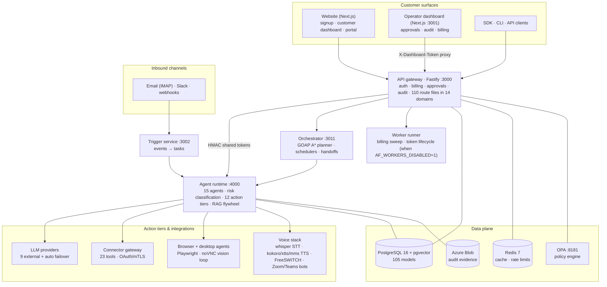
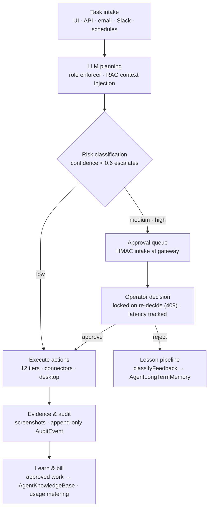

> **Status:** Sprint 18 complete. See [IMPLEMENTATION_STATUS.md](IMPLEMENTATION_STATUS.md) for the authoritative status tracker.
# AgentFarm Architecture — Full System

> Last updated: 2026-05-29 (Sprint 18)
> **Freshness (2026-06-13 audit):** Added since this doc was written: worker-runner, browser-agent and desktop-agent containers, the full voice/telephony stack (whisper, kokoro, xtts, mms-tts, voxcpm, freeswitch, zoom-video-sidecar, teams-media-bot - see VOICE_SYSTEM.md), and the sales/support/portal domains. docker-compose now defines 23 services. See the Technical Architecture Report in the audit set. Full verified inventory: [docs/audit/2026-06-13](audit/2026-06-13/README.md).
> AgentFarm — Multi-tenant AI agent platform with enterprise control gates, audit trails, and governed autonomy.

---

## Product Architecture Diagram (verified 2026-06-13)



### Task lifecycle (verified 2026-06-13)



---

## System Overview

AgentFarm is a TypeScript pnpm monorepo. It provides a production-grade platform for running AI agents inside enterprise teams. Every agent action passes through a risk classification pipeline, an approval gate, an audit log, and a compliance evidence chain before or after execution. The platform supports 12 agent roles, 8+ LLM providers, 18 external connectors, dual-provider payments (Stripe + Razorpay), Zoho Sign e-signature with auto-provisioning, Azure VM runtime provisioning, and a full voice/meeting pipeline.

---

## Monorepo Structure

```
d:\AgentFarm\
├── apps/
│   ├── agent-runtime/        AI agent execution engine (Fastify, 12 roles, 8 LLMs, voice)
│   │   └── src/              110+ source files — execution-engine, llm-decision-adapter,
│   │                         role-system-prompts, voicebox-client, voxcpm2-client,
│   │                         pre-task-scout, post-task-closeout, escalation-engine,
│   │                         skills-registry, multi-agent-orchestrator, speaking-agent
│   ├── api-gateway/          Fastify control-plane backend (all business logic)
│   │   └── src/
│   │       ├── routes/       75+ route files — auth, billing, approvals, audit, connectors,
│   │       │                 admin-provision, zoho-sign-webhook, meetings, runtime-tasks,
│   │       │                 governance-workflows, budget-policy, plugin-loading, ...
│   │       ├── services/     payment-service, provisioning-worker, contract-generator,
│   │       │                 zoho-sign-client, connector-token-lifecycle-worker, ...
│   │       └── lib/          session-auth, approval-packet, secret-store, rate-limit, ...
│   ├── dashboard/            Ops dashboard (Next.js, approval queue, evidence panel)
│   ├── orchestrator/         Multi-agent workflow coordinator (GOAP planner, scheduler)
│   ├── trigger-service/      Slack/Email/Webhook trigger ingestion (Fastify, port 3002)
│   └── website/              Public website + admin portal (Next.js 15, port 3002)
│       └── app/
│           ├── api/          43 API route groups (auth, billing, admin, webhooks, ...)
│           ├── admin/        Admin billing, provisioning, user management pages
│           ├── marketplace/  AI agent marketplace (179 agents, 29 departments)
│           └── ...           50+ more pages
├── packages/
│   ├── db-schema/            Prisma schema (PostgreSQL) — 45+ models, 10+ migrations
│   ├── shared-types/         100+ versioned TypeScript contracts, DesktopOperator interface
│   ├── connector-contracts/  18-connector registry, 18 normalized action types
│   ├── queue-contracts/      Queue event type definitions
│   ├── observability/        Structured telemetry helpers
│   └── notification-service/ Email notification gateway
├── services/
│   ├── agent-observability/  Action interception, browser capture, correctness scoring
│   ├── agent-question-service/ Async agent Q&A with human teammates
│   ├── approval-service/     Approval enforcement, kill-switch, governance workflow manager
│   ├── audit-storage/        Azure Blob screenshot uploader, evidence persistence
│   ├── browser-actions/      Playwright browser action executor
│   ├── compliance-export/    JSON/CSV compliance packs, 365-day/730-day retention
│   ├── connector-gateway/    OAuth, token refresh, adapter registry, mTLS cert verifier
│   ├── evidence-service/     Governance KPI calculator, HNSW vector search
│   ├── identity-service/     Tenant/workspace/user lifecycle
│   ├── meeting-agent/        Meeting lifecycle state machine, STT/TTS adapters
│   ├── memory-service/       Long-term memory store with TTL and relevance ranking
│   ├── notification-service/ Telegram/Slack/Discord/Webhook/Voice approval alerts
│   ├── policy-engine/        Governance routing policy resolution
│   ├── provisioning-service/ Azure VM lifecycle, 11-step state machine, SLA monitoring
│   └── retention-cleanup/    Scheduled retention cleanup job
├── infrastructure/
│   ├── control-plane/        Azure Bicep IaC for control-plane resources
│   └── runtime-plane/        Azure ARM + Bicep + cloud-init for VM provisioning
├── docker/
│   └── voxcpm2/              VoxCPM2 TTS + voice cloning (openbmb/VoxCPM2) Docker service
├── packages/db-schema/       Prisma schema, migrations
├── docker-compose.yml        PostgreSQL 16, Redis 7, VoxCPM2
├── pnpm-workspace.yaml       Monorepo workspace config
└── .env.example              All environment variables with placeholders
```

---

## Data Flow Diagrams

### Customer Journey Flow

```
                              DISCOVERY PATH
                              ══════════════
  Website Visit
       │
       ├─► Contact Form ──► CRM (Sales Rep Agent) ──► Discovery Call
       │                                                     │
       │                                              Quote Generated
       │
                              SELF-SERVE PATH
                              ══════════════
  Website Visit
       │
       ├─► Marketplace ──► Select Plan ──► Payment
       │                                      │
       │              ┌───────────────────────┤
       │              │                       │
       │         India (INR)           International
       │         Razorpay              Stripe
       │              │                       │
       │              └───────────┬───────────┘
       │                          │
       │                   Webhook Received
       │                   (HMAC verified)
       │                          │
       │                  Order marked PAID
       │                  Invoice created
       │                          │
       │              Contract PDF generated (pdfkit)
       │                          │
       │              Uploaded to Zoho Sign
       │              ┌───────────────────────────┐
       │              │   Document Request         │
       │              │   Recipient: customer      │
       │              │   E-signature required     │
       │              └───────────────────────────┘
       │                          │
       │              Customer signs (Zoho Sign UI)
       │                          │
       │              Zoho Sign Webhook fires ──────────► POST /api/webhooks/zoho-sign
       │                          │                                  │
       │                  Order: signatureStatus=signed      ProvisioningJob created
       │                          │                           status: queued
       │                          │
       │              ProvisioningWorker picks up job
       │              11-step Azure VM state machine:
       │              queued → validating → creating_resources
       │                   → configuring_network → deploying_vm
       │                   → installing_runtime → registering_bot
       │                   → health_checking → completed
       │                          │
       └─────────────► Customer Dashboard shows live status
```

### Agent Execution Flow

```
  Trigger Sources
  ═══════════════
  Slack message ─────────┐
  Email received ─────────┤
  Webhook POST ───────────┼──► Trigger Service (port 3002)
  Teams message ──────────┤         │
  API call ───────────────┘         │
                                    â–¼
                             Trigger Router
                             (workspace lookup,
                              rate limiting)
                                    │
                                    â–¼
                             API Gateway (port 3000)
                             /v1/tasks  POST
                                    │
                                    â–¼
                             Agent Runtime
                             ┌──────────────────────────────────┐
                             │  Pre-Task Scout                   │
                             │  (codebase scan, context load)    │
                             │              │                    │
                             │              ▼                    │
                             │  LLM Decision Adapter             │
                             │  (role prompt + task envelope)    │
                             │              │                    │
                             │     ┌────────┴─────────┐         │
                             │     │ Risk Classification│         │
                             │     │  low │ medium │high│         │
                             │     └──┬───────┬────┬───┘         │
                             │        │       │    │             │
                             │        ▼       ▼    ▼             │
                             │     Execute  Approval  Escalate   │
                             │     (async)  Queue     (human)    │
                             │        │                          │
                             │        ▼                          │
                             │  LLM Provider (8 options)         │
                             │  OpenAI│Anthropic│Google│xAI      │
                             │  Mistral│Together│AzureOAI│Auto   │
                             │        │                          │
                             │        ▼                          │
                             │  Post-Task Closeout               │
                             │  (evidence, memory, skills)       │
                             └──────────────────────────────────┘
                                        │
                                        â–¼
                             Reply Dispatcher
                             (Slack/Email/Teams/Webhook)
```

### Voice Pipeline

```
  Audio Input (microphone / meeting recording)
          │
          â–¼
  Voicebox MCP Client
  (transcription via Whisper-compatible API)
          │
          â–¼
  Transcript text
          │
          â–¼
  LLM (Speaking Agent role)
  (processes query, generates response)
          │
          â–¼
  VoxCPM2 TTS Client
  (openbmb/VoxCPM2 — Docker service)
  voice cloning │ prosody control │ SSML
          │
          â–¼
  Audio Output (stream / file / meeting channel)
```

### Approval Flow

```
  Agent Action Decision
          │
          ├─── LOW RISK ──────────────────► Execute immediately
          │                                      │
          │                               Audit event logged
          │
          ├─── MEDIUM RISK ────────────► Approval queue (API Gateway)
          │                                      │
          │                           Notification dispatched
          │                           (Slack/Telegram/Webhook)
          │                                      │
          │                       Human approves or rejects
          │                                      │
          │                       ┌──────────────┴────────────┐
          │                       │ APPROVED                  │ REJECTED
          │                       │ Execute + audit           │ Audit + notify
          │                       └───────────────────────────┘
          │
          └─── HIGH RISK ──────────────► Approval queue
                                   + escalation after 1 hour SLA
                                   + kill-switch can block all
```

---

## Database Schema

All models are in `packages/db-schema/prisma/schema.prisma`. PostgreSQL 16.

### Auth & Identity
| Model | Purpose |
|---|---|
| `Tenant` | Top-level org account |
| `TenantUser` | User belonging to a tenant |
| `Workspace` | A workspace within a tenant |
| `Bot` | An AI bot bound to a workspace |

### Provisioning & Runtime
| Model | Purpose |
|---|---|
| `ProvisioningJob` | Azure VM provisioning job (11-step state machine) |
| `RuntimeInstance` | Running bot Docker container state |
| `BotCapabilitySnapshot` | Point-in-time capability snapshot of a bot |

### Agent Execution
| Model | Purpose |
|---|---|
| `AgentSession` | Session context for an agent run |
| `AgentShortTermMemory` | Working context memory (TTL-bound) |
| `AgentLongTermMemory` | Crystallized long-term memory (relevance ranking) |
| `AgentRepoKnowledge` | Indexed repo knowledge graph entries |
| `TaskExecutionRecord` | Full task execution record with evidence |
| `ActionRecord` | Individual agent action within a task |

### Approval & Governance
| Model | Purpose |
|---|---|
| `Approval` | Approval record (immutable after decision) |
| `AuditEvent` | Append-only audit log entry |
| `RetentionPolicy` | Data retention rules per tenant |

### Connectors
| Model | Purpose |
|---|---|
| `ConnectorAuthMetadata` | OAuth app credentials per connector |
| `ConnectorAuthSession` | Active OAuth token for a user/connector |
| `ConnectorAuthEvent` | Lifecycle event (grant, refresh, revoke) |
| `ConnectorAction` | Normalized action execution record |

### Workspace State
| Model | Purpose |
|---|---|
| `WorkspaceSessionState` | Persistent IDE/workspace session context |
| `WorkspaceCheckpoint` | Snapshot of workspace state at a point in time |
| `DesktopProfile` | Desktop operator config for a workspace |
| `IdeState` | IDE open files, cursor, selection state |
| `TerminalSession` | Terminal session tracking |
| `EnvProfile` | Environment variable profile for a workspace |

### Developer Workflow
| Model | Purpose |
|---|---|
| `DesktopAction` | Desktop/browser action record |
| `PrDraft` | Pull request draft created by agent |
| `CiTriageReport` | CI failure triage analysis |
| `WorkMemory` | Short-lived per-task work notes |
| `RunResume` | Checkpoint for resuming an interrupted run |
| `ReproPack` | Repro package for a bug/issue |
| `ActivityEvent` | User/agent activity event stream |
| `BrowserActionEvent` | Browser automation event captured |

### Intelligence
| Model | Purpose |
|---|---|
| `AgentQuestion` | Question sent to human by agent (async Q&A) |
| `TenantMcpServer` | MCP tool server registration per tenant |

### Language & Localisation
| Model | Purpose |
|---|---|
| `TenantLanguageConfig` | Preferred language for a tenant |
| `WorkspaceLanguageConfig` | Language override per workspace |
| `UserLanguageProfile` | Per-user language preference |

### Voice & Meetings
| Model | Purpose |
|---|---|
| `MeetingSession` | Meeting transcription session lifecycle |

### Billing & Payments
| Model | Purpose |
|---|---|
| `Plan` | Subscription plan (name, priceInr, priceUsd, agentSlots, features) |
| `Order` | Payment order with Zoho Sign contract fields |
| `Invoice` | Invoice generated after payment |

---

## API Gateway Routes

Full reference in [API.md](API.md).

### Route Groups (75+ route files)

| Group | Prefix | Purpose |
|---|---|---|
| auth | `/v1/auth` | Login, signup, session management |
| billing | `/v1/billing` | Orders, webhooks (Stripe/Razorpay), plans |
| admin-provision | `/v1/admin/provision` | Manual VM provisioning trigger |
| zoho-sign-webhook | `/v1/webhooks/zoho-sign` | Zoho Sign completion webhook |
| approvals | `/v1/approvals` | Approval queue CRUD |
| audit | `/v1/audit` | Audit log query |
| connectors | `/v1/connectors` | Connector auth and action dispatch |
| meetings | `/v1/meetings` | Meeting session lifecycle |
| runtime-tasks | `/v1/tasks` | Agent task lease and execution |
| governance-workflows | `/v1/governance` | Governance policy management |
| budget-policy | `/v1/budget` | Budget limit enforcement |
| language | `/v1/language` | Language config |
| plugin-loading | `/v1/plugins` | Plugin manifest and loading |
| mcp-registry | `/v1/mcp` | MCP tool server registration |
| observability | `/v1/observability` | Metrics and health |
| memory | `/v1/memory` | Agent memory read/write |
| webhooks | `/v1/webhooks` | Generic inbound webhook ingestion |

---

## Agent Runtime

### 12 Agent Roles
1. `developer` — code writing, refactoring, review
2. `fullstack_developer` — end-to-end feature implementation
3. `tester` — test writing, coverage analysis
4. `business_analyst` — requirements, specs, acceptance criteria
5. `technical_writer` — documentation, API docs
6. `content_writer` — marketing copy, blog posts
7. `sales_rep` — lead qualification, CRM updates
8. `marketing_specialist` — campaign planning, analytics
9. `corporate_assistant` — internal ops, scheduling
10. `recruiter` — candidate qualification, outreach
11. `devops` — infrastructure, CI/CD, deployment
12. `data_analyst` — data queries, reporting, dashboards

### 8 LLM Providers
| Provider | Mode |
|---|---|
| OpenAI (GPT-4o, o3-mini) | Direct API |
| Azure OpenAI | Deployment endpoint |
| GitHub Models | github.com/marketplace/models |
| Anthropic (Claude Sonnet/Opus) | Direct API |
| Google (Gemini Pro/Flash) | Direct API |
| xAI (Grok) | Direct API |
| Mistral | Direct API |
| Together AI | Hosted open models |
| Auto | Health-score failover across all providers |

### Key Engine Components
- **Pre-task scout** — scans codebase, loads relevant context before LLM call
- **Post-task closeout** — writes evidence, updates memory, crystallizes skills
- **Escalation engine** — triggers on confidence < 0.6 or high-risk classification
- **Language injection** — resolves tenant/workspace/user language into system prompt
- **Memory system** — short-term (TTL), long-term (relevance ranking), repo knowledge graph
- **Skills crystallization** (Hermes pattern) — successful runs become reusable skill templates
- **Multi-agent orchestrator** — coordinating parallel agent task execution

---

## Voice System

- **Voicebox** — MCP-integrated transcription service (Whisper-compatible, `VOICEBOX_URL`)
- **VoxCPM2** — TTS + voice cloning Docker container (`openbmb/VoxCPM2`, `VOXCPM2_MODEL_ID`)
- **Meeting transcription pipeline** — join meeting → capture audio → transcribe → process → respond → speak
- **Speaking agent** — dedicated agent role that generates spoken responses
- **MCP registration** — `voicebox-mcp-registrar.ts` auto-registers Voicebox at startup

---

## Payment System

Full reference in [PAYMENTS.md](PAYMENTS.md).

### Flow
```
Customer checkout
       │
       ├─ India ──► Razorpay order ──► client SDK ──► webhook (/v1/billing/webhook/razorpay)
       │                                                        │
       └─ International ──► Stripe intent ──► client SDK ──► webhook (/v1/billing/webhook/stripe)
                                                               │
                                                    HMAC/signature verified
                                                               │
                                                   Order: status = paid
                                                   Invoice record created
                                                               │
                                                    setImmediate (non-blocking)
                                                               │
                                               pdfkit contract PDF generated
                                                               │
                                               Uploaded to Zoho Sign (multipart)
                                                               │
                                               submitDocumentForSigning()
                                                               │
                                          Order: zohoSignRequestId, contractSentAt, signatureStatus=sent
                                                               │
                                                  Customer signs in Zoho Sign UI
                                                               │
                                              POST /v1/webhooks/zoho-sign
                                              (x-zoho-webhook-token verified)
                                                               │
                                          Order: signatureStatus=signed, signedAt
                                                               │
                                              ProvisioningJob created (queued)
                                                               │
                                           Provisioning worker → Azure VM → done
```

---

## Infrastructure

- **Azure ARM Provisioning Worker** — `apps/api-gateway/src/services/provisioning-worker.ts` — polls `queued` jobs, drives 11-step state machine
- **Bicep IaC** — `infrastructure/control-plane/` and `infrastructure/runtime-plane/` — declarative Azure resources
- **cloud-init** — VM bootstrap script installs Docker, pulls agent container, configures environment
- **Docker Compose** — `docker-compose.yml` — PostgreSQL 16, Redis 7
- **VoxCPM2 Docker** — `docker/voxcpm2/` — TTS voice synthesis service
- **OPA Policy Engine** — `OPA_BASE_URL` — Open Policy Agent for governance decisions
- **Redis** — `REDIS_URL` — session cache, rate limiting, task queue

---

## Security

- **HMAC-SHA256 session tokens** — `buildSessionToken` / `verifySessionToken` in `lib/session-auth.ts`
- **Zoho Sign webhook verification** — `x-zoho-webhook-token` header compared against `ZOHO_SIGN_WEBHOOK_TOKEN`
- **Stripe webhook verification** — `stripe.webhooks.constructEvent()` with `STRIPE_WEBHOOK_SECRET`
- **Razorpay webhook verification** — HMAC-SHA256 of `order_id|payment_id` against `RAZORPAY_KEY_SECRET`
- **OPA policies** — governance rules evaluated per action request
- **Connector OAuth** — CSRF nonce validation, token stored as Key Vault references (no inline secrets)
- **mTLS certificate verifier** — `connector-gateway` verifies agent federation requests
- **PII-strip middleware** — strips sensitive fields from connector action payloads in logs
- **Rate limiting** — `lib/rate-limit.ts` in api-gateway
- **Scope enforcement** — `scope: 'internal'` required for admin routes, `scope: 'customer'` for user routes

---

## Testing Strategy

Full reference in [TESTING.md](TESTING.md).

| Package | Framework | Tests | Command |
|---|---|---|---|
| `@agentfarm/agent-runtime` | `node:test` | 906 | `pnpm --filter @agentfarm/agent-runtime test` |
| `@agentfarm/api-gateway` | `node:test` | 898 | `pnpm --filter @agentfarm/api-gateway test` |
| `@agentfarm/dashboard` | `node:test` | 118 | `pnpm --filter @agentfarm/dashboard test` |
| `@agentfarm/website` | `node:test` | 118 | `pnpm --filter @agentfarm/website test` |
| `@agentfarm/orchestrator` | `node:test` | 62 | `pnpm --filter @agentfarm/orchestrator test` |
| `@agentfarm/trigger-service` | `node:test` | 49 | `pnpm --filter @agentfarm/trigger-service test` |
| All other services | `node:test` | 200+ | per-package |

**Key patterns:**
- `t.mock.method(globalThis, 'fetch', ...)` — fetch mocking for HTTP calls
- Optional `prisma?` parameter on route handlers — injected mock Prisma in tests
- `Fastify().inject()` — full HTTP round-trip tests without a running server
- Coverage enforced ≥ 80% on execution-engine, runtime-server, provisioning-monitoring
