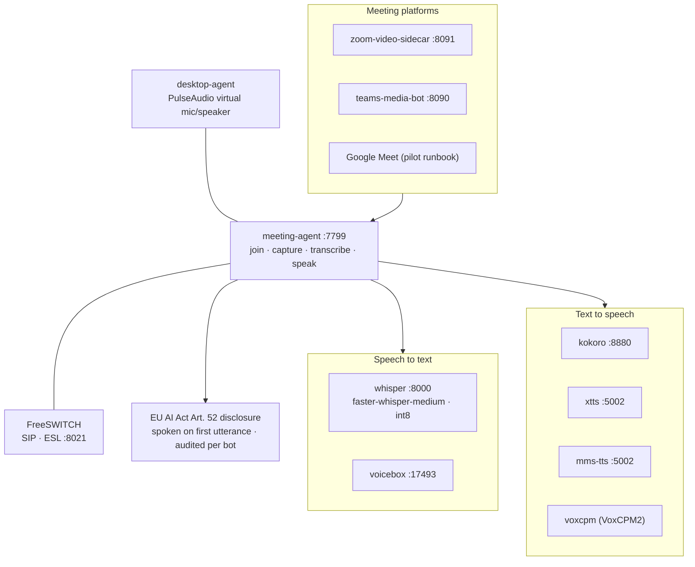

# AgentFarm Voice & Meeting Stack

> **Created:** 2026-06-13 (full-repo audit) · First documentation of the voice subsystem, which post-dates the Sprint-18 doc set entirely. Evidence: `docker-compose.yml`, `docker/`, `.env.example`, `services/meeting-agent`. Items the repo cannot prove are marked **Unknown**.

---

## 0. Topology

## 1. Components (verified in docker-compose.yml and .env.example)

| Service | Default endpoint | Role | Image source |
|---|---|---|---|
| `voicebox` | `http://voicebox:17493` | STT transcription (original pipeline) | compose |
| `whisper` | `http://whisper:8000` | STT — model `Systran/faster-whisper-medium`, compute `int8` | compose |
| `kokoro` | `http://kokoro:8880` | TTS | compose |
| `xtts` | `http://xtts:5002` | TTS | custom not found — compose-pulled; build context: **Unknown** |
| `mms-tts` | `http://mms-tts:5002` | TTS | `docker/mms-tts/` |
| `voxcpm` | — | TTS (VoxCPM2) | `docker/voxcpm2/` |
| `freeswitch` | ESL `freeswitch:8021` (password `ClueCon` default — **change in prod**), SIP profile `external` | Telephony switch | `docker/freeswitch/` |
| `zoom-video-sidecar` | `http://zoom-video-sidecar:8091` | Zoom meeting media | `docker/zoom-video-sidecar/` |
| `teams-media-bot` | `http://teams-media-bot:8090` | Teams meeting media | `docker/teams-media-bot/` (+ `.Tests` project) |
| `meeting-agent` | `http://meeting-agent:7799` | Meeting lifecycle orchestration | `services/meeting-agent` |
| `desktop-agent` | — | PulseAudio virtual mic/speaker for meeting audio injection | `docker/desktop-agent/` |

Multiple TTS engines exist; selection logic/priority between kokoro/xtts/mms-tts/voxcpm: **Unknown – Requires clarification from the development team** (check meeting-agent voice pipeline adapters).

## 2. Configuration

Key env vars (`.env.example`): `VOICEBOX_URL`, `WHISPER_ENDPOINT`, `WHISPER_STT_MODEL`, `WHISPER_COMPUTE_TYPE`, `KOKORO_ENDPOINT`, `XTTS_ENDPOINT`, `MMS_TTS_ENDPOINT`, `MEETING_AGENT_URL`, `MEETING_AGENT_TOKEN`, `MEETING_SERVICE_TOKEN`, `MEETING_SLACK_DISTRIBUTION`/`MEETING_SLACK_WEBHOOK_URL` (post-meeting distribution), `ZOOM_ACCOUNT_ID`/`ZOOM_CLIENT_ID`/`ZOOM_CLIENT_SECRET`/`ZOOM_VIDEO_SIDECAR_URL`/`ZOOM_SIDECAR_TOKEN`, `TEAMS_MEDIA_BOT_URL`, `FREESWITCH_ESL_HOST`/`PORT`/`PASSWORD`/`SIP_PROFILE`.

## 3. Capabilities (verified in code/docs)

- **Meeting participation loop:** join → capture audio → transcribe → speak (README, meeting-agent service state machine; `MeetingSession` + `MeetingAuditEvent` models).
- **12 role voice profiles** ("Alex" through "Rowan") auto-seeded at runtime startup.
- **Language-aware TTS:** language resolver + tenant/workspace/user language config (`LANGUAGE_SYSTEM.md`).
- **Compliance:** EU AI Act Art. 52 disclosure enforced on the first meeting utterance; disclosure audit per bot.
- **Telephony actions:** connector contracts define `initiate_call`, `hangup_call`, `transfer_call`, `get_call_status`, `get_call_recording`, `send_dtmf` for Twilio/Vonage/Amazon Connect/Genesys/generic (`packages/connector-contracts`); `CallRecord` model + `calls-webhook.ts`/`twilio-webhook.ts` in sales routes.
- **Support voice:** support voice sessions (`routes/support/support-voice-session.ts`); the support agent doc references a Sarvam AI voice bot (`SUPPORT_AGENT.md` §6).
- **Pilot validation:** `operations/runbooks/google-meet-pilot-smoke-test.md`.

## 4. Open Items

1. **Model licensing for commercial use** (faster-whisper, kokoro, XTTS, MMS, VoxCPM2): **Unknown — must be verified before selling voice features** (XTTS in particular has historically had a non-commercial license — verify the deployed variant).
2. TTS engine selection policy: **Unknown** (see §1).
3. FreeSWITCH default ESL password must be overridden in production.
4. Which meeting platforms are production-ready vs pilot (Google Meet pilot runbook exists; Zoom/Teams sidecars exist): **Unknown – confirm with the team.**
