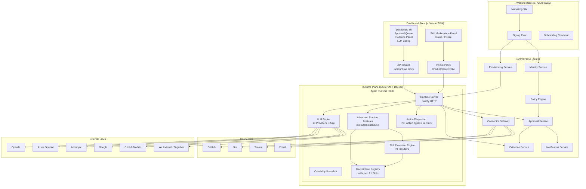
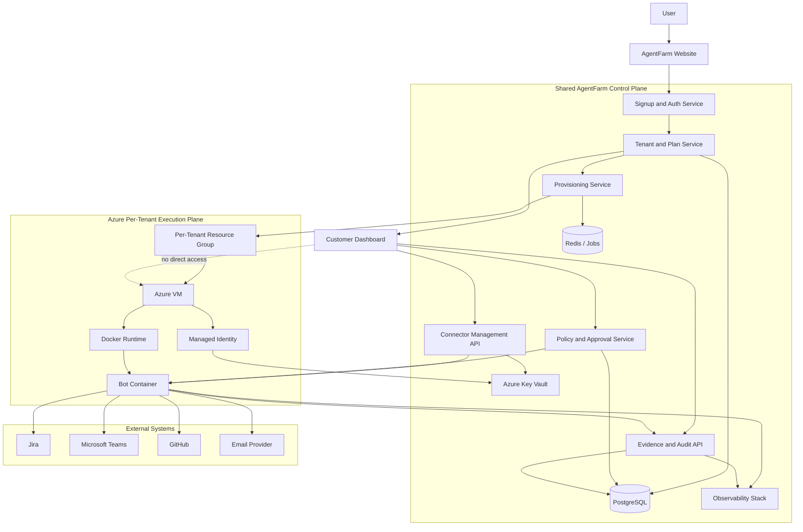

# AgentFarm Product Architecture

## Purpose
Define the end-to-end architecture that must be approved before development starts.

## How To Use This Document
1. Work step by step from Step 0 to Step 10.
2. Update only the current step section when reviewing.
3. Record every major change in the change log at the end of this file.
4. If a change impacts release gates, update ADRs and risk register on the same day.

## Step-by-Step Architecture Workflow (Editable)
## Step 0: Scope and Constraints
Objective:
- Confirm what is in scope for v1 and what is out of scope.
Update this section:
1. In-scope roles:
 - Developer Agent
2. In-scope integrations:
- Jira, Microsoft Teams, GitHub, company email
3. Out-of-scope items:
 - Multi-role orchestration, live meeting voice agent, and HR interview automation in MVP
4. Hard constraints:
- Planning-first rule remains active until signoff
Exit criteria:
- Scope is frozen and matches MVP scope document.

## Step 1: Define System Boundaries
Objective:
- Confirm boundaries for control plane, runtime plane, and evidence plane.
Update this section:
1. Control plane boundary:
- Identity, policy, approval, connector configuration
2. Runtime plane boundary:
- Task orchestration, role execution, action routing
3. Evidence plane boundary:
- Logs, approvals, score evidence, operational metrics
Exit criteria:
- No overlap ambiguity across planes.

## Step 2: Define Core Components
Objective:
- Confirm core services and single-owner accountability.
Update this section:
1. Identity Service owner:
- Engineering Lead
2. Policy and Risk Engine owner:
- Security and Safety Lead
3. Approval Service owner:
- Security and Safety Lead
4. Orchestration Service owner:
- Engineering Lead
5. Connector Gateway owner:
- Engineering Lead
6. Observability Service owner:
- Engineering Lead
Exit criteria:
- Every component has a named owner.

## Step 3: Define Action Lifecycle
Objective:
- Lock the execution flow from task intake to completion.
Update this section:
1. Lifecycle version:
- v1
2. Risk decision point:
- After action generation
3. Approval injection point:
- Before medium/high-risk action execution
4. Failure fallback path:
- Escalate to human and log incident tag
Exit criteria:
- Lifecycle can be traced end-to-end with no missing state.

## Step 4: Define Data and Audit Model
Objective:
- Finalize minimum required fields for action, approval, and evidence records.
Update this section:
1. Required action fields complete:
- Yes
2. Required approval fields complete:
- Yes
3. Required evidence fields complete:
- Yes
4. Retention and immutability policy:
- Retain active audit records for 12 months and archive for 24 months with append-only evidence controls.
Exit criteria:
- Audit completeness supports release-gate evidence.

## Step 5: Define Risk and Approval Policy
Objective:
- Finalize low, medium, and high-risk behavior.
Update this section:
1. Low-risk policy:
- Auto-execute with full logging
2. Medium-risk policy:
- Mandatory approval
3. High-risk policy:
- Mandatory approval with escalation timeout
4. Kill switch policy:
- Global immediate stop for risky execution
Exit criteria:
- Risk taxonomy approved by Security and Safety Lead.

## Step 6: Define Integration Contracts
Objective:
Update this section:
1. Jira contract status:
- Approved
2. Microsoft Teams contract status:
- Approved
3. GitHub contract status:
- Approved
4. Company email contract status:
- Approved
5. Contract versioning rule:
- Semver-like contract version per connector
Exit criteria:
- All connector contracts reviewed and signed off by Engineering Lead.

## Step 7: Define Security and Compliance Controls
Objective:
- Confirm security baseline controls and compliance evidence path.
Update this section:
1. Access control model:
- Role-based, least privilege
2. Secrets handling approach:
- Managed identity plus Key Vault reference model; no plaintext secrets in code, image, or runtime files.
3. AI disclosure enforcement:
- Required in all user-visible channels
4. Incident runbook link:
- planning/spec-incident-runbook-pack.md
Exit criteria:
- No critical control gaps remain open.

## Step 8: Define Reliability and SLO Targets
Objective:
- Confirm operational quality bar for MVP.
Update this section:
1. Workflow availability target:
- 99.5 percent
2. Approval routing success target:
- 99.9 percent
3. Audit completeness target:
- 100 percent on risky actions
4. P95 approval latency target:
- Under 2 minutes
Exit criteria:
- Targets align with release gates and operating review cadence.

## Step 9: Define Decision Governance
Objective:
- Ensure ADR and risk workflows are integrated into architecture updates.
Update this section:
1. ADR set in scope:
- ADR-001 to ADR-005
2. Risk register sync frequency:
- Weekly minimum, same-day for major changes
3. Escalation trigger:
- Any gate-impacting change
Exit criteria:
- Governance process is executable by assigned owners.

## Step 10: Final Signoff Package
Objective:
- Produce a review-ready signoff output for go or no-go decision.
Update this section:
1. Signoff decision:
- Go
2. Signatories:
- Product Lead, Engineering Lead, Security and Safety Lead, Architecture Owner
3. Required attachments:
- ADR status snapshot, risk snapshot, connector readiness snapshot
4. Blocking issues:
- None.
5. Remediation owners and dates:
- None required.
Exit criteria:
- Pre-development exit criteria are complete and approved.

## Developer Build Blueprint (What To Develop)
This section is the implementation view for engineering teams.

---

## System Architecture Diagram (as of 2026-05-05)



---

## Skill Marketplace Architecture

### Overview
The Skill Marketplace adds a curated catalog of 21 developer-agent skills that can be installed into any bot workspace and invoked on-demand through the dashboard or the runtime API.

### Components
| Component | Location | Purpose |
|---|---|---|
| `skills.json` | `apps/agent-runtime/marketplace/skills.json` | Catalog of 21 skills with SHA-256 integrity digests |
| `skill-execution-engine.ts` | `apps/agent-runtime/src/` | Pure TypeScript handlers for all 21 skills |
| `POST /runtime/marketplace/install` | Runtime Server | Install a skill into a bot workspace |
| `POST /runtime/marketplace/invoke` | Runtime Server | Execute an installed skill by ID with input payload |
| `GET /runtime/marketplace/list` | Runtime Server | Browse available skills |
| `AdvancedRuntimeFeatures.executeInstalledSkill()` | `advanced-runtime-features.ts` | Validates, dispatches, and records invocations |
| `/api/runtime/[botId]/marketplace/invoke` | Dashboard proxy | Authenticated Next.js proxy for skill invocations |
| Skill Marketplace Panel | `apps/dashboard/` | Browse, install, and invoke skills from the UI |

### 21 Registered Skill Handlers
| # | Skill ID | Category | Risk |
|---|---|---|---|
| 1 | `pr-reviewer-risk-labels` | Code Review | Low |
| 2 | `code-review-summarizer` | Code Review | Low |
| 3 | `pr-comment-drafter` | Code Review | Low |
| 4 | `issue-autopilot` | Issue Tracking | Medium |
| 5 | `branch-manager` | Git Operations | Medium |
| 6 | `commit-diff-explainer` | Code Review | Low |
| 7 | `test-coverage-reporter` | Testing | Low |
| 8 | `flaky-test-detector` | Testing | Low |
| 9 | `test-generator` | Testing | Low |
| 10 | `ci-failure-explainer` | CI/CD | Low |
| 11 | `dependency-audit` | Security | Medium |
| 12 | `release-notes-generator` | Release | Low |
| 13 | `incident-patch-pack` | Incident Response | High |
| 14 | `error-trace-analyzer` | Debugging | Low |
| 15 | `rollback-advisor` | Incident Response | High |
| 16 | `docstring-generator` | Documentation | Low |
| 17 | `readme-updater` | Documentation | Low |
| 18 | `api-diff-notifier` | API Governance | Medium |
| 19 | `slack-incident-notifier` | Notifications | Low |
| 20 | `jira-issue-linker` | Issue Tracking | Low |
| 21 | `pr-description-generator` | Code Review | Low |

### Skill Invocation Flow
```
Dashboard (Skill Marketplace Panel)
  → POST /api/runtime/[botId]/marketplace/invoke
    → Next.js proxy route (session-validated)
      → POST /runtime/marketplace/invoke (Fastify)
        → AdvancedRuntimeFeatures.executeInstalledSkill()
          → checks installed-skills.json
          → getSkillHandler(skillId) → SKILL_HANDLERS registry
          → handler(inputs, startedAt) → SkillOutput
          → recordMarketplaceUsage(skillId, 'invoke')
        → returns SkillOutput { ok, summary, result, risk_level, requires_approval, actions_taken, duration_ms }
```

---

## Strategic Guardrails (Do Not Drift)
Use these guardrails to keep every technical decision aligned to product vision.

1. Gate-first rule
- No runtime feature is considered complete unless it improves or preserves score-5 readiness for Identity, Role Fidelity, and Autonomy.
2. Approval-first autonomy
- Medium and high-risk actions must remain human-approved in all environments.
3. Audit-first engineering
- Every risky action, approval, and escalation must produce complete and queryable evidence.
4. Open source with boundaries
- Use open source for acceleration, but keep policy engine, approval logic, and evidence model as internal core IP.
5. Security over velocity
- Any dependency or feature that weakens security or auditability is blocked until mitigated.
6. Single source of truth
 - Contracts, risk policy, and release gates are managed through this architecture doc plus ADR and risk register.
7. No scope creep in v1
- Developer Agent plus Jira, Microsoft Teams, GitHub, and company email only.

## Approved Toolset v1
This table defines final tool choices by rollout stage.

| Category | Tool or Product | Decision | Why | Notes |
| --- | --- | --- | --- | --- |
| Must-have | OpenClaw | Keep | Core runtime, channels, skills, and gateway ecosystem | Use as primary agent runtime |
| Must-have | Paperclip | Keep | Multi-agent orchestration, budgets, governance, and heartbeats | Use as organization control plane |
| Must-have | PostgreSQL | Keep | Durable transactional and audit data model | Primary datastore |
| Must-have | Redis + BullMQ | Keep | Queueing, retries, delayed jobs | Worker reliability for v1 |
| Must-have | OpenTelemetry + Prometheus + Grafana + Loki + Tempo | Keep | End-to-end observability and audit evidence support | Required for ops and gate metrics |
| Must-have | OPA (Open Policy Agent) | Keep | Policy-as-code for approval and risk controls | Connect to approval service decisions |
| Must-have | Vault (or equivalent) | Keep | Secret management and rotation | Required for connector credentials |
| Must-have | Next.js + NestJS + TypeScript | Keep | Consistent full-stack developer velocity | Aligns with current architecture baseline |
| Nice-to-have | awesome-openclaw-agents | Conditional keep | Fast template bootstrapping and inspiration | Treat as template source only |
| Nice-to-have | awesome-openclaw-skills | Conditional keep | Large skill discovery catalog | Curated intake only; security review required |
| Nice-to-have | Composio | Optional | Faster OAuth and third-party app integrations | Add if connector velocity becomes bottleneck |
| Phase-2 | Claw3D | Phase-2 | Strong visualization and operations UX | Add after core reliability and approval flows are stable |
| Phase-2 | Temporal | Phase-2 | Durable long-running orchestration and replay | Adopt when workflow complexity exceeds BullMQ comfort zone |
| Phase-2 | Advanced memory service (Mem0 or Zep pattern) | Phase-2 | Better long-term context quality and memory APIs | Implement through internal memory boundary |
| Avoid-for-now | claude-mem in SaaS core path | Avoid for now | License and deployment constraints for core commercial service | Revisit only after legal review |
| Avoid-for-now | Unvetted community skills directly in production | Avoid for now | Security and trust risk | Fork and vet before production use |
| Avoid-for-now | Over-expanding connector scope in v1 | Avoid for now | Scope risk and gate slippage | Keep to 4 approved integrations |

## Product Surfaces (v1)
1. Admin Console (web)
- Configure roles, policies, connectors, and disclosures.
2. Approval Inbox (web)
- Review and approve medium/high-risk actions.
3. Customer Dashboard (web)
- View bot status, logs, approvals, connector health, and plan details.
4. Agent Runtime API (backend)
 - Task intake, role execution, risk scoring, and action dispatch.
5. Connector Gateway (backend)
- Jira, Microsoft Teams, GitHub, and company email integrations.
6. Evidence and Audit API (backend)
 - Query action logs, approval logs, and release-gate evidence.
7. Worker Runtime (background)
- Async execution, retries, and timeout handling.

## User Signup and Bot Provisioning Lifecycle
This is the runtime lifecycle once a customer signs up.

1. User signup and workspace creation
- User creates account on AgentFarm website.
- System creates tenant, workspace, subscription plan, and admin identity.
2. Plan and role selection
- User selects plan tier and primary bot role.
- System creates bot profile, default policy pack, and connector checklist.
3. Control plane setup
- AgentFarm control plane stores tenant metadata, role config, plan limits, and approval settings.
- Dashboard becomes available immediately.
4. Isolated runtime provisioning
- Backend provisioning service creates isolated execution environment in Azure based on plan.
- Bot runtime is deployed in Docker inside the provisioned environment.
5. Secure bootstrap
 - Runtime receives configuration via managed identity and secret retrieval flow.
 - Connector credentials are injected securely and never hardcoded into the image.
6. Connector activation
- User connects Jira, Microsoft Teams, GitHub, and company email from dashboard.
7. Bot goes live
- Bot starts processing tasks, logs actions, and requests approvals for medium/high-risk operations.
8. Ongoing operations
- User monitors status, logs, approvals, and connector health from dashboard.
- Platform enforces budgets, policy updates, security controls, and incident handling.

## Azure Hosting Model (v1)
This is the preferred architecture interpretation of your idea.

1. Shared control plane
- The AgentFarm web app, APIs, approval system, evidence system, and provisioning logic run as shared SaaS control plane services.
- Control plane stores tenant metadata, logs, policies, billing state, and dashboard data.
2. Isolated execution plane
- Each customer bot runs in an isolated Docker runtime in Azure.
- Isolation exists to reduce cross-tenant risk and keep customer workloads separated.
3. Dedicated runtime by plan
- Premium or high-trust plans: dedicated Azure VM per customer workspace.
- Lower-cost plans: reserved for future shared-cluster or container-based execution model.
4. Secure runtime baseline
- Docker container runs the bot and its connector workers.
- VM is hardened with restricted inbound access, private networking, and no direct public shell access.
- Secrets are retrieved through managed identity and Key Vault.
5. Why Azure VM + Docker is valid
- Strong isolation boundary for v1.
- Easier reasoning about tenant separation.
- Better support for custom runtimes and enterprise trust conversations.
6. Important constraint
- Per-customer VM is secure but more expensive and slower to provision than container-native platforms.
- Treat dedicated VM-per-customer as a deliberate v1 isolation strategy, not the only long-term architecture.

## Azure Resource Layout (v1)
1. Shared resource group for control plane
- Web frontend, APIs, shared database, Redis, observability, Key Vault.
2. Per-tenant runtime resource group
- One Azure VM, NIC, disk, NSG, optional private IP, managed identity, and monitoring agent.
3. Container image flow
- Bot images are built once and pulled into tenant VMs from secure registry.
4. Network model
- Control plane communicates to tenant runtimes over private or restricted channels.
- Customer dashboard never talks directly to runtime VM.

## Azure Security Model (v1)
1. Management plane
- Provisioning service creates and manages tenant runtime infrastructure.
- Access is controlled with least-privilege Azure RBAC.
2. Runtime plane
- Bot runs only inside Docker container on tenant VM.
- Host access is limited to platform operators and emergency procedures.
3. Secret flow
- Use Azure Managed Identity plus Azure Key Vault.
- Do not store connector secrets in code, images, or plain VM files.
4. Network hardening
- Deny direct public inbound unless explicitly required.
- Prefer Bastion, private networking, or tightly restricted management access.
5. Auditability
- Provisioning events, bot actions, approval actions, and connector events must all be logged.

## Recommended Interpretation of Your Concept
1. Keep this architecture rule
- Shared AgentFarm control plane plus isolated per-customer execution environment.
2. Keep this security rule
- Bot must stay inside Docker runtime and never be trusted with unrestricted host escape.
3. Adjust this scaling rule
- Start with dedicated Azure VM per customer for secure v1 or premium tiers.
- Revisit container-native multi-tenant execution after v1 once policy and audit controls are proven.

## Tiered Runtime Deployment Model
This section turns the Azure runtime choice into a product-tier decision instead of a one-size-fits-all infrastructure rule.

1. v1 secure default
- Use isolated Azure VM plus Docker for early customers and security-sensitive pilots.
- Best for proving trust, auditability, and customer-specific runtime isolation.
2. Premium isolation tier
- Keep dedicated VM-per-customer or VM-per-workspace for enterprise and regulated customers.
- Best for high-trust deployments, custom runtime needs, and stronger tenant separation.
3. Future scale tier
- Move lower-tier plans to container-native execution after v1 controls are proven.
- Candidates for future state: Azure Container Apps, AKS, or another orchestrated container platform.
- Best for lower cost, faster provisioning, and higher density.
4. Shared rule across all tiers
- AgentFarm control plane remains shared.
- Policy, approvals, logs, audit evidence, and tenant metadata stay centralized.
- Execution runtimes stay isolated by tenant boundary defined by plan.

## Final Architecture Recommendation
1. Product model
- Shared SaaS control plane for account creation, plans, policies, logs, dashboard, and approvals.
2. Runtime model
- Isolated execution environments for bots.
- Docker is required runtime boundary for bot processes.
3. v1 hosting choice
- Azure VM plus Docker is the correct launch architecture for secure early rollout.
4. Growth model
- Keep VM isolation for premium customers.
- Introduce container-native multi-tenant execution only after policy, audit, and approval systems are proven stable.
5. Non-negotiable platform rule
- No architecture change is allowed if it weakens Identity, Role Fidelity, or Autonomy gate readiness.

## Visual Architecture Diagram


Diagram notes:
1. Shared control plane owns signup, provisioning, policy, logs, and dashboard experiences.
2. Each tenant bot runs inside Docker on an Azure VM in an isolated execution plane.
3. The dashboard never talks directly to the VM; all user actions pass through the control plane.
4. Managed identity and Key Vault handle secure runtime configuration and secret access.

## Recommended Stack (v1 Default)
1. Language and package management
- TypeScript on Node.js LTS.
- Monorepo with pnpm workspaces.
2. Backend framework
- NestJS for modular services and consistent dependency injection.
- Fastify adapter for API performance.
3. Frontend framework
- Next.js (App Router) with TypeScript.
- Tailwind CSS for fast UI iteration.
4. Data layer
- PostgreSQL as primary transactional store.
- Prisma ORM for schema and migrations.
5. Queue and cache
- Redis + BullMQ for jobs, retries, and delayed tasks.
6. Auth and access control
- OIDC SSO with Microsoft Entra ID or Auth0.
- JWT for service APIs and role-based access in control plane.
7. Observability
- OpenTelemetry for traces and metrics.
- Grafana stack (Prometheus, Loki, Tempo) for dashboards.
8. API contracts
- OpenAPI for REST APIs.
- Zod schemas for runtime payload validation.
9. CI/CD and quality
- GitHub Actions for pipelines.
- ESLint, Prettier, and unit/integration test gates.

## External Products and Integrations Used
1. Jira Cloud API
 - Task creation, updates, comments, and status sync.
2. Microsoft Teams and Graph APIs
- Notifications, approval actions, activity summaries, and enterprise chat presence.
3. GitHub API
 - PR metadata, review comments, and workflow signals.
4. Company email provider
- Microsoft Graph API for Outlook or Gmail API for Google Workspace.
5. Identity provider
- Microsoft Entra ID preferred for enterprise SSO.

## Service Breakdown (Backend)
1. control-plane-api
- Owns role config, policy config, connector setup, and disclosure settings.
2. runtime-api
- Owns task intake, planning, risk scoring, and action orchestration.
3. approval-api
- Owns approval queue, decision capture, and escalation flows.
4. connector-gateway
- Owns provider clients and normalized integration contracts.
5. evidence-api
- Owns audit queries, score evidence, and review exports.
6. worker-engine
- Owns async execution, retries, dead-letter handling, and timeout recovery.

## Minimum Data Tables (v1)
1. roles
2. policies
3. connectors
4. tasks
5. actions
6. approvals
7. incidents
8. evidence_records
9. users
10. audit_events

## API Set (v1)
1. POST /tasks
 - Create new task from Jira, Microsoft Teams, GitHub, or email source.
2. POST /tasks/{id}/plan
 - Generate proposed actions for a task.
3. POST /actions/{id}/execute
 - Execute low-risk action or route approval.
4. POST /approvals/{id}/decision
 - Approve or reject medium/high-risk action.
5. GET /audit/events
- Retrieve filtered audit trail.
6. GET /evidence/gates
- Retrieve gate evidence for scoring reviews.

## Suggested Monorepo Layout
1. apps/admin-console
2. apps/approval-inbox
3. apps/control-plane-api
4. apps/runtime-api
5. apps/approval-api
6. apps/connector-gateway
7. apps/evidence-api
8. apps/worker-engine
9. packages/shared-types
10. packages/policy-sdk
11. packages/integration-contracts
12. infra/

## Implementation Order (Developer Sequence)
1. Foundation
- Monorepo, CI, lint/test, shared types, auth skeleton.
2. Core runtime
- Task intake, action planning, risk tiers, and low-risk execution.
3. Approval path
- Approval API, inbox UI, escalation timeout, and kill switch wiring.
4. Connector depth
- Jira and Microsoft Teams first, then GitHub and company email.
5. Evidence and audit
- Immutable event logging and evidence query endpoints.
6. Hardening
- Load tests, failure drills, security review, and signoff artifacts.

## Environment Topology
1. local
- Developer laptops with docker-compose dependencies.
2. dev
- Shared integration environment for connector testing.
3. staging
- Production-like environment for release gate validation.
4. production
- Controlled rollout with alerting and incident workflow.

## Definition of Done (Engineering)
1. Functional
- Required endpoints and flows pass acceptance criteria.
2. Reliability
- Retries and timeout behavior validated in staging.
3. Security
- No critical vulnerabilities and secrets rotation path documented.
4. Auditability
- All risky actions produce complete action and approval logs.
5. Operability
- Dashboards and alerts exist for workflow success and approval latency.

## Canonical Editing Rule
1. This document's step-by-step workflow and developer blueprint are the single source of truth.
2. Architecture decisions must be reflected in:
- planning/architecture-decision-log.md
- planning/architecture-risk-register.md
- planning/engineering-execution-design.md
- planning/spec-product-structure-model-architecture.md
- planning/spec-tenant-workspace-bot-model.md
- planning/spec-azure-provisioning-workflow.md
- planning/spec-dashboard-data-model.md
- planning/spec-docker-runtime-contract.md
- planning/spec-connector-auth-flow.md
- planning/spec-incident-runbook-pack.md
3. Do not duplicate architecture sections in other formats inside this file.

## Architecture Change Log
Use this table whenever architecture content changes.

| Date | Section Updated | Change Summary | Reason | Owner | Related ADR | Related Risk |
| --- | --- | --- | --- | --- | --- | --- |
| 2026-04-17 | Initial step-by-step workflow | Added editable architecture build process from Step 0 to Step 10 | Improve review and iterative updates | Architecture Owner | ADR-001 | R-005 |
| 2026-04-18 | Developer Build Blueprint | Added Strategic Guardrails and Approved Toolset v1 table with must-have, nice-to-have, phase-2, and avoid-for-now decisions | Freeze tool strategy and prevent architecture drift | Architecture Owner | ADR-001 | R-001 |
| 2026-04-18 | Canonical structure cleanup | Removed duplicated architecture baseline sections and retained one canonical architecture flow | Prevent drift and reduce review ambiguity | Architecture Owner | ADR-001 | R-005 |
| 2026-04-18 | Visual architecture diagram | Added Mermaid diagram for signup, control plane, Azure execution plane, and external connectors | Improve technical communication for engineering and investor review | Architecture Owner | ADR-001 | R-001 |
| 2026-04-25 | Data layer | Prisma + Supabase-hosted PostgreSQL adopted as primary data layer with portability-preserving design | Fast delivery with managed DB; migration path preserved | Platform Lead | ADR-006 | — |
| 2026-04-29 | Runtime execution engine | Nine-provider LLM adapter added with health-score fallback, Auto mode, and dashboard preset config panel | Eliminate single-provider lock-in; improve reliability under partial outages | Engineering Lead | ADR-007 | R-006 |
| 2026-04-30 | Local workspace execution surface | 81 workspace action types implemented (Tier 0–8) in local-workspace-executor.ts. safeChildPath sandbox enforcement, redactSecrets output filter, globToRegex pattern helper. Risk taxonomy applied to all actions. | Developer Agent can now autonomously read, write, refactor, test, format, and commit code in sandboxed workspace | Engineering Lead | ADR-008 | R-007 |
| 2026-05-01 | Tier 12 specialist profiles | Added AgentFarm-native specialist profiles for GitHub issue fixing, PR review, issue triage, Azure deployment, deploy monitoring, and incident response. Tier 12 actions now accept deterministic `initial_plan` / `fix_attempts` payloads and return imported skill-agent provenance in audit output. | Reuse curated OpenClaw workflow logic without reintroducing external coding CLI dependencies | Engineering Lead | ADR-009 | R-007 |
| 2026-05-01 | Tier 12 planning actions and payload overrides | Promoted GitHub issue triage and Azure deployment planning to first-class workspace actions, and extended the LLM decision contract to emit sanitized payload overrides that survive approval and execution paths. | Turn specialist profiles into directly callable planning workflows while preserving deterministic subagent plans generated by the LLM | Engineering Lead | ADR-009 | R-007 |
| 2026-04-30 | Sprint 1 completion and future roadmap | Added Build Completion Status, Developer Agent Capabilities reference, Future Roadmap (near/medium/enterprise phases), updated Risk Register (R-001 through R-007), updated ADR baseline to ADR-009, updated Immediate Next Action to reflect pilot phase entry | Sprint 1 code-complete; platform ready for production deployment | Engineering Lead | ADR-009 | R-005 |
| 2026-04-18 | Tiered runtime deployment model | Added v1 secure default, premium isolation tier, and future scale tier to clarify Azure VM strategy without losing original product direction | Finalize hosting strategy and prevent long-term infrastructure confusion | Architecture Owner | ADR-001 | R-001 |
| 2026-04-18 | Engineering design reference | Linked architecture baseline to execution-design artifact for implementation planning | Bridge approved architecture into engineering delivery | Architecture Owner | ADR-001 | R-001 |
| 2026-04-18 | Supporting execution specs | Linked tenant/workspace model, Azure provisioning workflow, and dashboard data model specs into the architecture baseline | Turn architecture into implementation-ready engineering design set | Architecture Owner | ADR-001 | R-001 |
| 2026-04-18 | Product structure model detail | Added a granular product-structure and model-architecture spec and linked it into the canonical architecture references | Enable minute-level architecture understanding before build execution | Architecture Owner | ADR-001 | R-005 |
| 2026-04-18 | Runtime and connector auth specs | Linked Docker runtime contract and connector auth flow specs into canonical architecture references | Close MVP execution design gaps and remove remaining architecture ambiguity | Architecture Owner | ADR-003 | R-001 |
| 2026-04-18 | Incident runbook pack spec | Linked incident/runbook pack spec into canonical architecture references and release pack | Complete MVP operational readiness architecture artifacts | Architecture Owner | ADR-005 | R-002 |

<!-- doc-sync: 2026-05-06 sprint-6 -->
> Last synchronized: 2026-05-06 (Sprint 6 hardening and quality gate pass).

<!-- doc-sync: 2026-05-06 full-pass-2 -->
> Last synchronized: 2026-05-06 (Full workspace sync pass 2 + semantic sprint-6 alignment).


## Current Implementation Pointer (2026-05-07)
1. For the latest built-state summary and file map, see planning/build-snapshot-2026-05-07.md.
